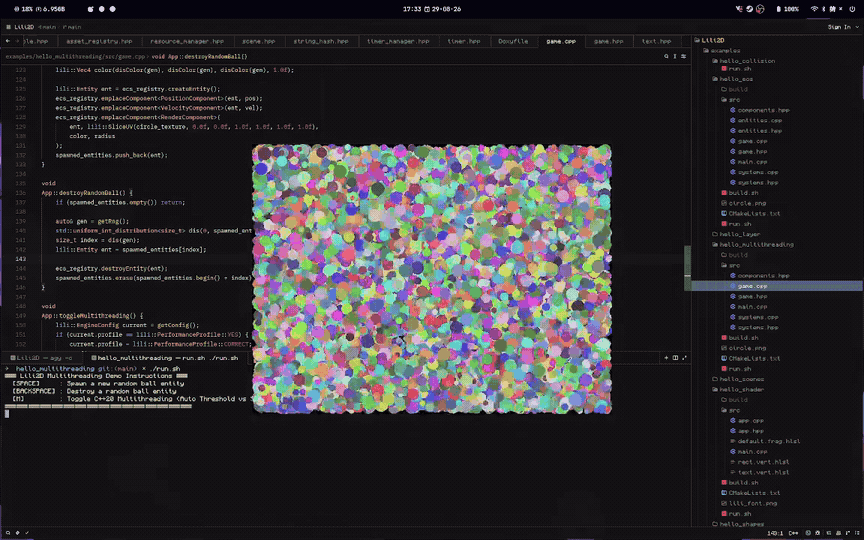

# Lili2D

   [](https://github.com/Linirby/Lili2D/actions/workflows/ci.yml)

Lili2D is a lightweight 2D game engine written in C++20, built on top of **SDL3** and **SDL_GPU**.

I created this project to learn modern engine architecture and have a fast, clean framework for 2D games and game jams. :3



## Features

- **SDL_GPU Renderer**: Hardware-accelerated 2D rendering with texture batching (`SpriteBatch`) and shape drawing (rectangles, circles, lines).
- **Entity Component System (ECS)**: Contiguous component pools with multi-component queries (`ECSView`) and a deferred command buffer.
- **Fixed Timestep**: Deterministic 60 TPS update loop with frame interpolation.
- **Asset Management**: Automatic caching for textures and shaders, with file hot-reloading (`Assets`).
- **UI Anchors & Pivots**: Simple 2D layout helpers for screen positioning and virtual resolution scaling.
- **Multithreading**: C++20 thread pool with priority queues (`HIGH`, `NORMAL`, `LOW`).
- **Collisions**: Fast 2D AABB and circle collision checks.
- **Tilemaps**: Chunk-based tile rendering with viewport frustum culling.

## Prerequisites

- **C++20 compiler** (GCC 10+, Clang 11+, or MSVC 2019+)
- **CMake** 3.10+
- **SDL3**, **SDL3_image**, and **SDL3_shadercross**

## Building

```bash
git clone https://github.com/Linirby/Lili2D.git
cd Lili2D
cmake -B build
cmake --build build -j$(nproc)
```

Run tests:
```bash
ctest --test-dir build --output-on-failure
```

## Quick Start

Here is a minimal example setting up a window, loading a sprite, and drawing shapes:

```cpp
#include <lili2d/lili2d.hpp>

class App : public lili::Game {
public:
    App() : lili::Game("Hello Lili2D :3", 800, 800) {}

    void onInit() override {
        // Set virtual logical resolution (automatic aspect ratio scaling)
        getWindow()->setLogicalResolution(800, 800);

        // Load a texture
        lili::Texture* cat_tex = lili::Assets::loadTexture(
            "cat", "assets/textures/cat.png", getRenderer()->getDevice()
        );

        // Create a sprite with UI anchor & pivot positioning
        sprite = lili::Sprite(getRenderer(), cat_tex);
        sprite.setAnchor(lili::Anchor::CENTER);
        sprite.setPivot(lili::Pivot::CENTER);
        sprite.setOffset({ 0.0f, -50.0f });

        // Create a vector shape
        circle = lili::Circle(
            getRenderer(),
            lili::CircleShape({ 400.0f, 600.0f }, 60.0f, 32),
            lili::Vec4(0.2f, 0.6f, 1.0f, 1.0f)
        );
    }

    void onRender(float alpha) override {
        (void)alpha;
        sprite.draw();
        circle.draw();

        // Direct primitive drawing
        getRenderer()->drawRect(
            lili::RectShape({ 50.0f, 50.0f }, { 120.0f, 40.0f }),
            lili::Vec4(1.0f, 0.5f, 0.0f, 1.0f), /*hollow=*/true
        );
    }

private:
    lili::Sprite sprite;
    lili::Circle circle;
};

int main() {
    App app;
    app.run();
    return 0;
}
```

## Examples

Check out the [`examples/`](examples/) folder for standalone code samples:

- **`hello_shapes`**: Basic 2D shapes (`Line`, `Rect`, `Circle`).
- **`hello_sprite`**: Texture loading and 2D sprite transforms.
- **`hello_text`**: Bitmap fonts and text alignment.
- **`hello_camera`**: Camera viewports, zoom, and render layers (`WORLD2D` vs `UI`).
- **`hello_layer`**: Render layer sorting and draw order.
- **`hello_scenes`**: Scene stack management and transitions.
- **`hello_animation`**: Sprite sheet animation (`AtlasMap`, `AnimationPlayer`).
- **`hello_shader`**: Custom SPIR-V vertex and fragment shaders.
- **`hello_collision`**: Collision checks (`AABB2`, `CircleCollider`).
- **`hello_sprite_batch`**: Batch rendering sprites in a single draw call.
- **`hello_tilemap`**: Tilemap chunks with frustum culling.
- **`hello_ecs`**: Entity Component System queries.
- **`hello_multithreading`**: Task scheduling via `ThreadPool`.

## Documentation

Full API documentation is available at: [https://linirby.github.io/Lili2D](https://linirby.github.io/Lili2D)

Or generate it locally with Doxygen:
```bash
cd docs
doxygen Doxyfile
```

## Community & Support

- Discord: **[Lili's | Dev Lounge](https://discord.gg/6S6HyKWgK3)**
- Support: **[ko-fi.com/liliowo](https://ko-fi.com/liliowo)** ❤️
