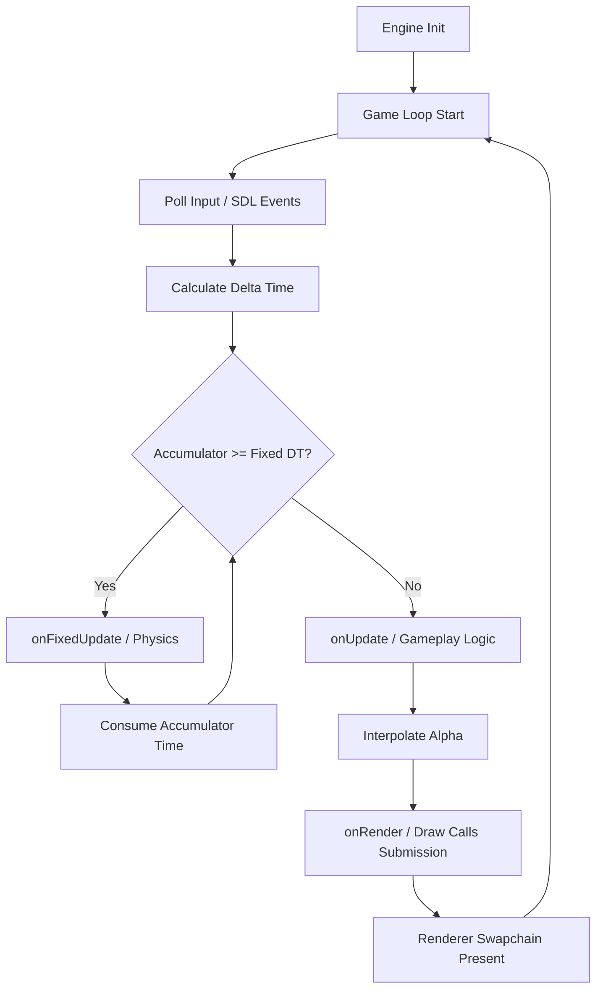

# Lili2D Engine Architecture & Systems Walkthrough

Welcome to the architectural overview of **Lili2D**, a lightweight custom 2D
game engine built on C++20 and SDL3.

This document showcases the core technical design, concurrency model, and memory
optimization strategies implemented in the engine. It is written to serve as a
deep-dive reference for all developers and technical leads.

---

## 1. Engine Core & The Game Loop

Lili2D is structured around a classic synchronized game loop utilizing a
decoupled fixed-physics update rate (TPS) and an interpolated frame render rate.



* **Decoupled Physics & Rendering**: Subclasses of `lili::Game` implement
`onFixedUpdate` for deterministic simulation, and `onRender(alpha)` for smooth,
framerate-independent rendering.
* **Encapsulated Subsystems**: Subsystems like the windowing manager (`Window`),
the low-level rendering wrapper (`Renderer`), and the thread scheduler
(`ThreadPool`) are encapsulated as private members inside the parent `Game`
class to protect ownership and lifecycle, exposed safely via read-only getters.

---

## 2. Priority-Scheduled Multithreading (`ThreadPool`)

To maximize modern CPU utilization while maintaining game responsiveness, Lili2D
features a custom, C++20 thread pool (`lili::ThreadPool`) with
**task prioritization**.

### Design Decisions

* **Fixed Core Utilization**: The pool instantiates a fixed number of worker
threads on startup (defaulting to `hardware_concurrency - 1` to leave one core
free for the OS and the main loop thread).
* **C++20 Concurrency**: Utilizes `std::jthread` for RAII-managed thread
lifecycles and cooperative cancellation via `std::stop_token`.
* **Priority Queues**: Tasks are enqueued with a `TaskPriority` enum (`HIGH`,
`NORMAL`, `LOW`):
  * **HIGH**: Time-critical gameplay systems (e.g., parallel ECS physics and collision).
  * **NORMAL**: General asynchronous assets or tasks.
  * **LOW**: Background/non-critical work (e.g., world chunk generation and mesh
  compiling).

```cpp
// Task popping priorities inside the worker thread loop
if (!high_tasks.empty()) {
    task = std::move(high_tasks.front());
    high_tasks.pop();
} else if (!normal_tasks.empty()) {
    task = std::move(normal_tasks.front());
    normal_tasks.pop();
} else if (!low_tasks.empty()) {
    task = std::move(low_tasks.front());
    low_tasks.pop();
}
```

---

## 3. Data-Oriented Entity Component System (ECS)

Lili2D implements a high-performance, Data-Oriented ECS (`lili::ECSRegistry`)
designed to minimize CPU cache misses and support multithreaded systems.

### CPU Cache Optimization (Contiguous Memory)
Components of the same type are stored back-to-back in memory arrays
(`ComponentPool<T>`). When a system iterates over components, the CPU loads
contiguous memory chunks into the L1/L2 cache, avoiding the cache misses of
pointer-heavy OOP designs.

```txt
[ComponentPool<Position>] -> [ Pos0 ][ Pos1 ][ Pos2 ][ Pos3 ]
Contiguous block (Cache Friendly!)
```

### Thread-Safe Command Buffer

When running ECS systems in parallel across multiple worker threads (e.g., a
movement system updating entities on different cores), modifying entity layouts
directly (like spawning or destroying entities) would create critical data
races. 

To solve this, Lili2D provides a deferred **Command Buffer** pattern:

1. Parallel worker threads read/write component data and queue
structure-modifying commands (like `spawnEntity` or `destroyEntity`).
2. The commands are stored in a thread-safe buffer.
3. At the end of the frame update stage, the main thread flushes the command
buffer and updates the ECS registry sequentially, guaranteeing thread safety
without lock contention.

---

## 4. Rendering & Memory Optimizations

To handle high-performance scene rendering and large worlds, Lili2D applies
strict memory culling and render budgeting.

### Camera Viewport Culling

Before submitting model geometry to the GPU, the `TileMap` culls all chunks
lying outside the active `Camera`'s viewport bounds. 

* Viewport bounds are calculated in world space by dividing the screen
dimensions by the camera zoom factor.
* Only chunks whose Axis-Aligned Bounding Boxes (AABB) intersect the viewport
bounds submit draw commands.

### Sprite Batching

Instead of making individual GPU draw calls for every single sprite (which
causes massive CPU-GPU driver overhead), Lili2D groups sprites sharing the same
texture and layer into a single `SpriteBatch`.

* Meshes are combined into a single vertex and index array.
* Pushed to the GPU in a single vertex/index buffer transfer.
* Drawn using a single GPU draw call (`SDL_DrawGPUIndexedPrimitives`).

### Dynamic Rebuild Budgeting

In large maps (e.g., `1500x1500` grids), zooming out or moving the camera
quickly can expose thousands of new chunks simultaneously. Compiling meshes for
thousands of chunks and uploading them to the GPU in a single frame would
exhaust Vulkan/Direct3D GPU command buffers, causing driver blocking and frame
freezing.

To prevent this, the engine implements a **rebuild budget**:

* Only a maximum of **8 new chunk rebuilds** are enqueued per frame.
* The remaining chunks are queued up and built gradually over subsequent frames.
* This guarantees a buttery-smooth 60+ FPS cinematic camera sweep without
resource-flooding freezes.

```cpp
int rebuilds_this_frame = 0;
for (auto &pair : chunks) {
    ...
    if (chunk.dirty || chunk.rebuilding) {
        if (chunk.dirty) {
            if (rebuilds_this_frame >= 8) {
                continue; // Defer new enqueues to the next frame
            }
            rebuilds_this_frame++;
        }
        chunk.rebuildBatches(renderer, thread_pool, chunk_pos, tile_size);
    }
}
```
