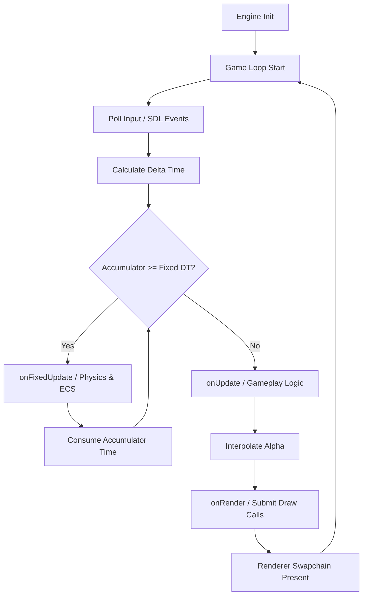
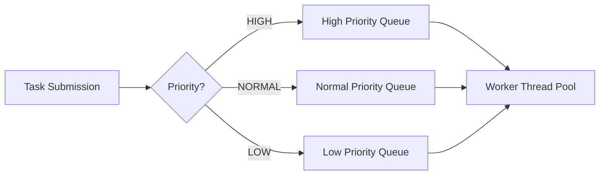
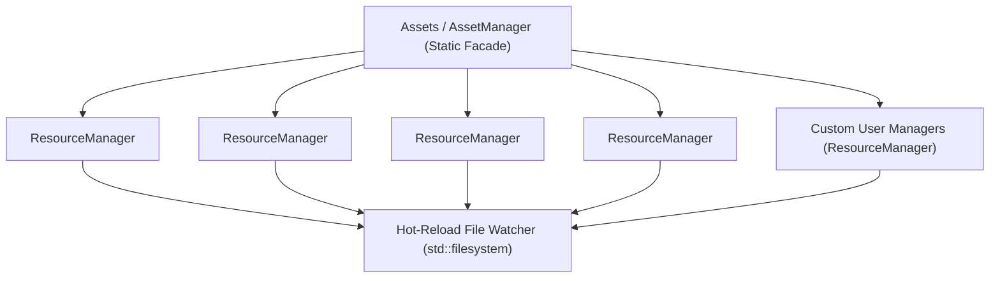
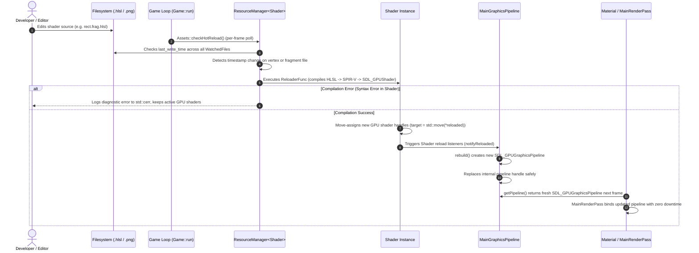
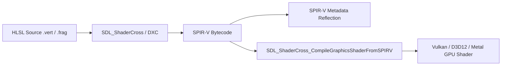
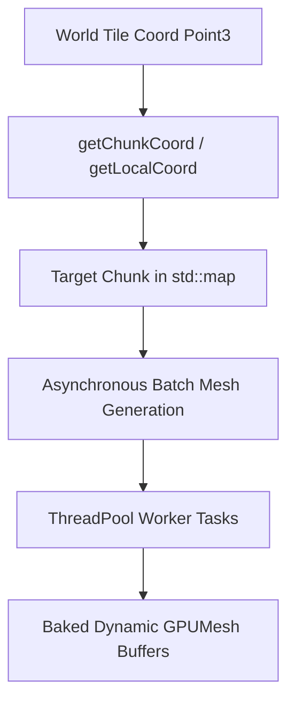

# Lili2D Engine Architecture & Systems Walkthrough

Welcome to the technical architectural overview of **Lili2D**, a high-performance 2D game engine built with **C++20** and **SDL3 / SDL_GPU**.

This document details the core system designs, concurrency patterns, memory layouts, transform pipelines, and GPU optimization strategies implemented across the engine. It serves as an in-depth reference for engine architects, technical leads, and developers.

---

## Table of Contents

| # | Subsystem / Topic | Key Focus & Patterns |
| :-: | :--- | :--- |
| **1** | [Engine Core & The Game Loop](#1-engine-core--the-game-loop) | Fixed-timestep simulation, render interpolation ($\alpha$), RAII subsystem ownership. |
| **2** | [Priority-Scheduled Multithreading (`ThreadPool`)](#2-priority-scheduled-multithreading-threadpool) | C++20 `std::jthread` workers, cooperative cancellation, 3-tier task priority queues. |
| **3** | [Data-Oriented Entity Component System (ECS)](#3-data-oriented-entity-component-system-ecs) | Contiguous `ComponentPool<T>` storage, thread-safe deferred `CommandBuffer`. |
| **4** | [Unified Scoped Asset & Resource Engine](#4-unified-scoped-asset--resource-engine) | Polymorphic `ResourceManager<T>`, tag-based scope memory isolation, static facade. |
| **5** | [Live Asset & Shader Hot-Reloading Architecture](#5-live-asset--shader-hot-reloading-architecture) | Filesystem timestamp watcher, observer pipeline rebuilding, runtime safety guards. |
| **6** | [UI Layout Engine & Matrix Transform Pipeline](#6-ui-layout-engine--matrix-transform-pipeline) | Normalized Anchor/Pivot layout math, 3x3 affine transforms, inverse matrix hit tests. |
| **7** | [Virtual Viewport Scaling & Logical Resolution](#7-virtual-viewport-scaling--logical-resolution) | Display-independent aspect ratio letterboxing, physical-to-logical coordinate mapping. |
| **8** | [Spatial Physics & Collision Query Subsystem](#8-spatial-physics--collision-query-subsystem) | `AABB2`, `AABB3`, `CircleCollider`, narrow-phase clamping math, zero-alloc debug draw. |
| **9** | [Hardware Rendering & GPU Memory Optimizations](#9-hardware-rendering--gpu-memory-optimizations) | Frustum culling, dynamic `SpriteBatch`, progressive chunk budget, GPU idle barriers. |
| **10** | [Custom Shader Cross-Compilation & Dynamic Uniform Buffering](#10-custom-shader-cross-compilation--dynamic-uniform-buffering) | HLSL $\rightarrow$ SPIR-V $\rightarrow$ Driver shader transpilation, direct command buffer uniform push. |
| **11** | [Input Action Mapping Subsystem (`ActionMap`)](#11-input-action-mapping-subsystem-actionmap) | String-keyed logical action bindings, tri-state input polling (`held`, `justPressed`, `justReleased`). |
| **12** | [Chunk-Based 3D Grid Tilemap & Asynchronous Meshing](#12-chunk-based-3d-grid-tilemap--asynchronous-meshing) | `Point3` spatial chunk maps, multithreaded vertex/index baking, layer collision sweep. |
| **13** | [Frame Animation Pipeline & Sprite Slicing (`AtlasMap`, `AnimationPlayer`)](#13-frame-animation-pipeline--sprite-slicing-atlasmap-animationplayer) | UV grid coordinate slicing, frame accumulator playback, frame-specific event hooks. |
| **14** | [Modern C++ Calling Conventions & Inlining Guidelines (Planned Optimization)](#14-modern-c-calling-conventions--inlining-guidelines-planned-optimization) | Pass-by-value ($\le 16$B PODs), System V/ARM64 ABI register passing, header inlining vs TU separation. |

---

## 1. Engine Core & The Game Loop

Lili2D centers around a synchronized fixed-timestep game loop that decouples deterministic physics updates (TPS) from variable rendering framerates (FPS) using an accumulator pattern.


```mermaid
graph TD
    A[Engine Init] --> B[Game Loop Start]
    B --> C[Poll Input / SDL Events]
    C --> D[Calculate Delta Time]
    D --> E{Accumulator >= Fixed DT?}
    E -- Yes --> F[onFixedUpdate / Physics & ECS]
    F --> G[Consume Accumulator Time]
    G --> E
    E -- No --> H[onUpdate / Gameplay Logic]
    H --> I[Interpolate Alpha]
    I --> J[onRender / Submit Draw Calls]
    J --> K[Renderer Swapchain Present]
    K --> B
```

### Core Architecture Highlights

* **Decoupled Simulation & Render Interpolation**: Subclasses of `lili::Game` implement `onFixedUpdate()` for tick-rate deterministic state updates, and `onRender(alpha)` for smooth, frame-rate independent visual interpolation.
* **RAII & Encapsulated Subsystems**: Low-level subsystem lifecycles (`Window`, `Renderer`, `ThreadPool`, `SceneManager`) are strictly owned by `Game`. Subsystem handles are exposed via read-only accessors to protect state invariants.
* **Global Runtime Bridge (`GameConfig`)**: Provides a centralized state manager for runtime window mode toggles (fullscreen, borderless, resizable, relative mouse) synced safely back to the active `Game` instance.

---

## 2. Priority-Scheduled Multithreading (`ThreadPool`)

To maximize multi-core CPU utilization while eliminating frame-pacing stutter, Lili2D provides a custom C++20 task scheduler (`lili::ThreadPool`) featuring explicit **task prioritization**.

### Concurrency Mechanics

* **Fixed Thread Allocation**: Worker threads default to `std::thread::hardware_concurrency() - 1`, preserving one dedicated core for OS scheduling and the main engine loop.
* **RAII Lifecycle & Cooperative Cancellation**: Worker threads run via `std::jthread` and monitor `std::stop_token` for clean thread-group tear-downs.
* **Priority-Based Task Queues**: Tasks are submitted with a `TaskPriority` enum (`HIGH`, `NORMAL`, `LOW`):
  * **HIGH**: Frame-critical tasks (parallel ECS physics, collision dispatch, camera updates).
  * **NORMAL**: Asynchronous asset decoding, geometry processing.
  * **LOW**: Background world generation, tilemap chunk mesh baking.


```mermaid
graph LR
    Sub[Task Submission] --> P{Priority?}
    P -- HIGH --> HQ[High Priority Queue]
    P -- NORMAL --> NQ[Normal Priority Queue]
    P -- LOW --> LQ[Low Priority Queue]
    HQ --> W[Worker Thread Pool]
    NQ --> W
    LQ --> W
```

```cpp
// Task selection routine executed by worker threads
if (!high_tasks.empty()) {
    task = std::move(high_tasks.front());
    high_tasks.pop();
} else if (!normal_tasks.empty()) {
    task = std::move(normal_tasks.front());
    normal_tasks.pop();
} else if (!low_tasks.empty()) {
    task = std::move(low_tasks.front());
    low_tasks.pop();
}
```

---

## 3. Data-Oriented Entity Component System (ECS)

Lili2D implements a cache-friendly Entity Component System (`lili::ECSRegistry`) designed around contiguous memory layouts and data-oriented design (DOD).

### Contiguous Memory Allocation (`ComponentPool<T>`)

Components of type `T` are stored sequentially in tightly packed arrays (`std::vector<T>`). When ECS systems execute, CPU L1/L2 data caches prefetch contiguous component slices, eliminating pointer-chasing and cache miss penalties inherent to traditional OOP hierarchies.

```txt
[ComponentPool<Position>] -> [ Pos0 ][ Pos1 ][ Pos2 ][ Pos3 ]  <-- (Packed Contiguous Block)
[ComponentPool<Velocity>] -> [ Vel0 ][ Vel1 ][ Vel2 ][ Vel3 ]  <-- (Packed Contiguous Block)
```

### Thread-Safe Deferred Command Buffer

Modifying ECS structures (spawning entities, attaching components, deleting entities) during multithreaded system execution creates critical data races. 

Lili2D resolves this using a deferred **Command Buffer** pattern:

1. Worker threads query components concurrently and submit structural mutation commands to `lili::CommandBuffer`.
2. Commands are accumulated in thread-safe deferred queues.
3. At the end of the frame tick, the main thread flushes `CommandBuffer` operations sequentially into `ECSRegistry`, guaranteeing lock-free system execution.

---

## 4. Unified Scoped Asset & Resource Engine

Asset management in Lili2D is powered by a dual-tier architecture: templated scoped resource managers (`lili::ResourceManager<T>`) and a centralized static facade (`lili::AssetManager` / `lili::Assets`).


```mermaid
graph TD
    Facade["Assets / AssetManager (Static Facade)"]
    Facade --> TexMgr["ResourceManager<Texture>"]
    Facade --> ShdMgr["ResourceManager<Shader>"]
    Facade --> FntMgr["ResourceManager<BitmapFont>"]
    Facade --> AtlMgr["ResourceManager<AtlasMap>"]
    Facade --> CustMgr["Custom User Managers (ResourceManager<T>)"]
    
    TexMgr --> HR["Hot-Reload File Watcher (std::filesystem)"]
    ShdMgr --> HR
    FntMgr --> HR
    AtlMgr --> HR
    CustMgr --> HR
```

### Key Design Patterns

* **Polymorphic Base Interface (`IResourceManager`)**: Type-erased base class enabling uniform lifecycle control, scope unloading, and hot-reload polling across heterogeneous resource types.
* **Scoped Memory Isolation (`unloadScope`)**: Resources are assigned scope tags (e.g. `"global"`, `"main_menu"`, `"level_01"`). Calling `Assets::unloadScope("level_01")` purges all unused textures, fonts, and shaders associated with that scene, preventing memory leaks during scene switches.
* **Extensible Type Registry**: Custom user asset types `T` can be registered dynamically via `Assets::getManager<T>()`, granting them full caching, scope control, and hot-reloading capabilities.

---

## 5. Live Asset & Shader Hot-Reloading Architecture

Lili2D implements an asynchronous, multi-stage hot-reloading pipeline that allows developers to modify textures, fonts, sprite sheets, and custom HLSL shaders (`.vert.hlsl` / `.frag.hlsl`) on disk while the game is running, updating GPU state in real-time without application restarts.


```mermaid
sequenceDiagram
    autonumber
    actor Dev as Developer / Editor
    participant Disk as Filesystem (.hlsl / .png)
    participant GameLoop as Game Loop (Game::run)
    participant RM as ResourceManager<Shader>
    participant S as Shader Instance
    participant P as MainGraphicsPipeline
    participant M as Material / MainRenderPass

    Dev->>Disk: Edits shader source (e.g. rect.frag.hlsl)
    GameLoop->>RM: Assets::checkHotReload() (per-frame poll)
    RM->>Disk: Checks last_write_time across all WatchedFiles
    RM->>RM: Detects timestamp change on vertex or fragment file
    RM->>S: Executes ReloaderFunc (compiles HLSL -> SPIR-V -> SDL_GPUShader)
    alt Compilation Error (Syntax Error in Shader)
        RM-->>Dev: Logs diagnostic error to std::cerr, keeps active GPU shaders
    else Compilation Success
        S->>S: Move-assigns new GPU shader handles (target = std::move(*reloaded))
        S->>P: Triggers Shader reload listeners (notifyReloaded)
        P->>P: rebuild() creates new SDL_GPUGraphicsPipeline
        P->>P: Replaces internal pipeline handle safely
        M->>P: getPipeline() returns fresh SDL_GPUGraphicsPipeline next frame
        M->>M: MainRenderPass binds updated pipeline with zero downtime
    end
```

### Multi-File Asset Tracking (`WatchedFile`)

Certain assets depend on multiple source files on disk (e.g., a `Shader` depends on both a vertex shader file and a fragment shader file). 

To ensure complete coverage:
* Each `ResourceRecord` stores a collection of `WatchedFile` entries:
  ```cpp
  struct WatchedFile {
      std::string path;
      std::filesystem::file_time_type last_write_time{};
  };
  ```
* When `Assets::loadShader(key, vertPath, fragPath, ...)` is called, `ResourceManager<Shader>` registers both paths in `watched_files`.
* During `checkHotReload()`, timestamps for all associated files are polled. If **any** watched file changes, the asset reloader triggers and all timestamps are updated simultaneously upon success.

### Observer-Driven Graphics Pipeline Rebuilding

In modern graphics APIs (Vulkan, Direct3D 12, Metal), a pipeline state object (`SDL_GPUGraphicsPipeline`) is immutable and baked at creation time with specific shader bytecode. Simply updating the `Shader`'s internal shader modules is insufficient because existing pipelines remain bound to the old state.

Lili2D resolves this using a reactive observer pattern:

1. **Shader Observer Interface**: `Shader` maintains a registry of reload listeners (`addReloadListener`, `removeReloadListener`, `notifyReloaded`).
2. **Automatic Pipeline Subscription**: When a `MainGraphicsPipeline` is constructed with a `Shader*`, it registers a callback on that shader.
3. **In-Place Pipeline Rebuilding**: When the shader reloads successfully:
   * `Shader::operator=(Shader&&)` executes `notifyReloaded()`.
   * The pipeline invokes `MainGraphicsPipeline::rebuild()`, cross-compiling and instantiating a new `SDL_GPUGraphicsPipeline` handle.
   * Smart pointer swapping (`pipeline.reset(new_pipeline)`) safely deallocates the previous pipeline once GPU execution has completed.
4. **Stable Material Binding (`Material::getPipeline()`)**: `Material` stores a `MainGraphicsPipeline*` pointer instead of a stale raw GPU handle. `Material::getPipeline()` dynamically returns the current active pipeline handle, ensuring all materials using that pipeline render with the new shader without requiring per-frame manual re-assignments in gameplay code.

### Exception Guards & Resilient Live Editing

When developers write shader code in an external editor, file saves frequently write partial or syntactically invalid code before completion:
* Shader recompilation is wrapped in exception boundaries inside `ReloaderFunc`.
* If compilation fails, the error message is printed to `std::cerr`, the reload returns `false`, and the active GPU shader and pipeline handles are left untouched.
* The game continues running smoothly using the previous valid shader until the syntax error is corrected.

---

## 6. UI Layout Engine & Matrix Transform Pipeline

All rendered 2D objects inherit from `lili::IRenderable`, establishing a unified interface for positions, scales, rotations, materials, and UI layout positioning.

### UI Pivot & Anchor Normalization

Lili2D features a coordinate-independent UI positioning pipeline based on normalized **Anchors** (screen/viewport relative) and **Pivots** (element bounding box relative).

* **Anchor**: Position relative to the active screen viewport (e.g. `TOP_LEFT` `(0,0)`, `CENTER` `(0.5,0.5)`, `BOTTOM_RIGHT` `(1,1)`).
* **Pivot**: Alignment origin inside the element's bounding rect (e.g. `CENTER` aligns rotation and translation to the element's mid-point).

$$\text{GlobalPos} = (\text{ViewportSize} \odot \vec{A}) + \vec{\text{Offset}} - (\text{ObjSize} \odot \vec{P})$$

### 3x3 Affine Matrix Transformation (`Mat3`)

Renderables construct a 3x3 transformation matrix combining translation, pivot shifts, scale factors, and 2D rotation:

$$M = T(\text{Position} + \text{AnchorOffset}) \cdot R(\theta) \cdot S(\text{Scale}) \cdot T(-\text{PivotOffset})$$

```cpp
// Calculating 3x3 transformation matrix for UI layout rendering
Mat3 transform = Mat3::translation(screen_pos) *
                 Mat3::rotation(rotation_rad) *
                 Mat3::scale(scale) *
                 Mat3::translation(-pivot_offset);
```

### Inverse-Matrix Point Containment (`containsPoint`)

To test if a screen/mouse coordinate intersects a transformed renderable element, `containsPoint()` multiplies the point by the **inverse** transformation matrix $M^{-1}$, mapping the coordinate into local unrotated element space for exact bounding box collision.

---

## 7. Virtual Viewport Scaling & Logical Resolution

To protect game logic and UI layouts from physical display resolution changes, window resizing, and aspect ratio variations, Lili2D provides a **Logical Resolution** subsystem (`Window::setLogicalResolution`).

### Aspect-Ratio Aware Letterboxing

When logical resolution is enabled (e.g., `800x600`), the engine computes scale factors and centers the game viewport within physical window dimensions using dynamic pillarboxing or letterboxing:

$$\text{Scale} = \min\left(\frac{\text{Physical}_W}{\text{Logical}_W}, \frac{\text{Physical}_H}{\text{Logical}_H}\right)$$

### Coordinate Space Mapping (`toLogicalCoords`)

Input events (mouse cursor coordinates, touch points) recorded in physical screen pixels are transformed into logical game space automatically:

$$\vec{P}_{\text{logical}} = \frac{\vec{P}_{\text{physical}} - \vec{V}_{\text{offset}}}{\text{Scale}}$$

This ensures mouse interactions, UI hit tests, and gameplay logic operate strictly in logical game coordinates regardless of monitor DPI or window resizing.

---

## 8. Spatial Physics & Collision Query Subsystem

Lili2D provides lightweight spatial primitive colliders for 2D gameplay physics, raycasting, and broad-phase/narrow-phase queries.

### Collision Primitives & Math

* **`AABB2` / `AABB3`**: Axis-Aligned Bounding Boxes for fast bounding volume hierarchies and rectangular/cuboid hitboxes.
* **`CircleCollider`**: Precise circle-to-circle, circle-to-box, and circle-to-line segment collision solver.

```cpp
// Circle-to-AABB Intersection Algorithm
Vec2 closest_point = {
    std::clamp(circle.center.x, aabb.min.x, aabb.max.x),
    std::clamp(circle.center.y, aabb.min.y, aabb.max.y)
};
Vec2 distance_vec = circle.center - closest_point;
bool intersects = (distance_vec.lengthSquared() <= (circle.radius * circle.radius));
```

### Zero-Allocation Debug Visualization

All colliders include a `debugDraw(renderer, color)` method that submits debug outlines directly to the line rendering pipeline without triggering heap allocations during frame steps.

---

## 9. Hardware Rendering & GPU Memory Optimizations

Lili2D relies on SDL3's `SDL_GPU` abstraction layer for direct modern graphics hardware execution (Vulkan, Direct3D 12, Metal).

### Camera Viewport Frustum Culling

Before submitting tilemap geometry to GPU command buffers, the `TileMap` culls all chunks lying outside the active `Camera` viewport bounds:

* Viewport bounds are calculated in world space by taking screen dimensions and applying inverse camera zoom/translation matrices.
* Chunks outside camera AABB boundaries skip mesh building and draw submission entirely.

### Automated Texture Batching (`SpriteBatch`)

To prevent driver bottlenecks caused by repetitive GPU draw call submissions, Lili2D groups sprites sharing identical texture bindings and render passes into a unified `SpriteBatch`:

* Sprite quads are merged into a single dynamic vertex array.
* Index and vertex data are transferred to GPU VRAM in a single memory upload.
* The batch is rendered via a single `SDL_DrawGPUIndexedPrimitives` draw call.

### Dynamic Rebuild Budgeting

When moving through large tilemap worlds (e.g. `1500x1500` grid maps), camera movement can expose many dirty chunks simultaneously. Rebuilding and uploading GPU buffers for hundreds of chunks in a single frame would exhaust command queue ring buffers and stutter the frame rate.

Lili2D enforces a strict **chunk rebuild budget**:

* A maximum of **8 chunk rebuilds** are enqueued to worker threads per frame tick.
* Excess dirty chunks are queued and rebuilt progressively over subsequent frames.
* Ensures a stable framerate during rapid camera movement across large worlds.

```cpp
int rebuilds_this_frame = 0;
for (auto &pair : chunks) {
    if (chunk.dirty || chunk.rebuilding) {
        if (chunk.dirty) {
            if (rebuilds_this_frame >= 8) {
                continue; // Defer remaining chunk rebuilds to next frame
            }
            rebuilds_this_frame++;
        }
        chunk.rebuildBatches(renderer, thread_pool, chunk_pos, tile_size);
    }
}
```

### GPU Idle Synchronization & Deleter Protections

To eliminate hardware race conditions, GPU use-after-free, and Vulkan descriptor validation errors (`VUID-VkWriteDescriptorSet-descriptorType-02997`) during resource reloads or scene teardowns, Lili2D enforces strict GPU synchronization:

* **RAII GPU Deleters**: Smart deleters for all device-dependent handles (`SDLGPUTextureDeleter`, `SDLGPUSamplerDeleter`, `SDLGPUBufferDeleter`, `SDLGPUShaderDeleter`, `SDLGPUGraphicsPipelineDeleter`) call `SDL_WaitForGPUIdle(device)` before invoking `SDL_ReleaseGPU...`.
* **Renderer Teardown Synchronization**: `Renderer::~Renderer()` idles the active GPU device (`SDL_WaitForGPUIdle`) prior to destroying pipelines, shaders, or GPU meshes during engine shutdown.
* **Defensive Render Pass Validation**: `MainRenderPass::render()` checks that vertex buffers, index buffers, textures, and samplers are non-null before binding and drawing. If any GPU resource is temporarily unallocated or undergoing hot-reload, the pass skips the draw call gracefully for that frame tick rather than passing null handles to the driver.

---

## 10. Custom Shader Cross-Compilation & Dynamic Uniform Buffering

Lili2D unifies shader authoring around **HLSL** as the canonical shading language, transpiling and cross-compiling shaders dynamically to the active backend driver via `SDL_ShaderCross`.


```mermaid
graph LR
    HLSL[HLSL Source .vert / .frag] --> DXC[SDL_ShaderCross / DXC]
    DXC --> SPIRV[SPIR-V Bytecode]
    SPIRV --> Refl[SPIR-V Metadata Reflection]
    SPIRV --> GPUComp[SDL_ShaderCross_CompileGraphicsShaderFromSPIRV]
    GPUComp --> Backend[Vulkan / D3D12 / Metal GPU Shader]
```

### Direct Uniform Push Architecture

Rather than allocating separate persistent uniform buffers per draw call, Lili2D leverages SDL3 GPU's immediate command buffer uniform push model:

* **Vertex Binding Slot 0 (Engine Uniforms)**: Standard MVP 3x3 matrix expanded to 12 floats (3x4 columns), tint color (`Vec4`), UV bounds (`Vec4`), render layer, and elapsed engine time.
* **Vertex Binding Slot 1 (Custom Vertex Uniforms)**: User-defined struct pushed via `material.setVertexUniforms(data)`.
* **Fragment Binding Slot 0 (Custom Fragment Uniforms)**: User-defined struct pushed via `material.setFragmentUniforms(data)`.

```cpp
// Arbitrary uniform struct definition in game code
struct WaveUniforms {
    float time;
    float amplitude;
    float frequency;
    float speed;
};

WaveUniforms uniforms{ clock.getTime(), 0.2f, 30.0f, 5.0f };
rect.getMaterial()->setVertexUniforms(uniforms);
```

At render time, `MainRenderPass::render` transmits the raw byte payloads directly into the command buffer stream via `SDL_PushGPUVertexUniformData` and `SDL_PushGPUFragmentUniformData`, achieving zero heap allocation during uniform updates.

---

## 11. Input Action Mapping Subsystem (`ActionMap`)

To eliminate hardcoded keyboard and mouse checks throughout gameplay systems, Lili2D provides a centralized, string-keyed **Action Mapping** subsystem (`lili::ActionMap`).

### Logical Action Abstraction

Actions decouple game logic from physical hardware input devices:

```cpp
// Register composite key and mouse bindings
ActionMap::get().add("Jump", { Key::SPACE, Key::W });
ActionMap::get().add("Shoot", {}, { MouseButton::LEFT });
ActionMap::get().add("MoveRight", { Key::D, Key::RIGHT });
```

### Tri-State Frame Queries

The action map processes input transitions per frame, allowing systems to query discrete input states:
* `isHeld("MoveRight")`: Returns `true` continuously while any assigned physical key/button is depressed.
* `isJustPressed("Jump")`: Returns `true` strictly on the exact frame the action was activated.
* `isJustReleased("Shoot")`: Returns `true` strictly on the frame the action was released.

---

## 12. Chunk-Based 3D Grid Tilemap & Asynchronous Meshing

Lili2D's world tilemap system (`lili::TileMap`) is architected for expansive grid-based environments using 3D chunk spatial partitioning (`Point3(chunkX, chunkY, layerZ)`).


```mermaid
graph TD
    WorldPos[World Tile Coord Point3] --> Hash[getChunkCoord / getLocalCoord]
    Hash --> Chunk[Target Chunk in std::map]
    Chunk --> Batch[Asynchronous Batch Mesh Generation]
    Batch --> TP[ThreadPool Worker Tasks]
    TP --> GPUMesh[Baked Dynamic GPUMesh Buffers]
```

### Key Architectural Mechanisms:
* **Spatial Chunk Indexing**: World coordinates are divided into fixed-dimension chunks (e.g. 16x16 tiles). Chunks are indexed in a sorted spatial map using `Point3Compare`.
* **Asynchronous Geometry Baking**: When tiles within a chunk change (`setTile`), the chunk marks itself dirty and dispatches geometry baking tasks to the `ThreadPool`. Worker threads construct vertex and index lists in parallel without stalling the main render loop.
* **Layer Depth & Collision Sweep**: The `checkCollision(AABB3)` solver queries solid tile IDs directly within relevant local chunk coordinates, performing rapid bounding box overlap tests without inspecting empty or non-collidable air tiles.

---

## 13. Frame Animation Pipeline & Sprite Slicing (`AtlasMap`, `AnimationPlayer`)

Lili2D handles 2D sprite animations through a decoupled animation model comprising `AtlasMap`, `AnimationRegistry`, and `AnimationPlayer`.

### Sub-Texture UV Slicing (`AtlasMap`)

Spritesheets are sliced into uniform grid cells (`slice(cols, rows)`). The engine computes normalized UV bounding coordinates for each frame:

$$\text{UV}_{\min} = \left(\frac{c}{\text{Cols}}, \frac{r}{\text{Rows}}\right), \quad \text{UV}_{\max} = \left(\frac{c+1}{\text{Cols}}, \frac{r+1}{\text{Rows}}\right)$$

### Playback & Event Hooks (`AnimationPlayer`)

* **Normalized Frame Accumulation**: `AnimationPlayer` accumulates game delta time against `frame_duration`, advancing the active frame index and wrapping according to the selected `LoopMode` (`Loop`, `Once`, `PingPong`).
* **Frame Callbacks**: Custom events (footstep SFX, attack hitbox activation, projectile spawning) can be attached to specific animation frame indices via `onFrame(frame_idx, callback)`.

---

## 14. Modern C++ Calling Conventions & Inlining Guidelines (Planned Optimization)

To maximize runtime throughput and align with modern C++ standard best practices, Lili2D follows specific parameter passing and inlining guidelines across its subsystems.

### 14.1 Pass-by-Value for Small Trivially Copyable Types ($\le 16$ Bytes / 128 Bits)

In historical C++ (C++98/03), passing non-primitive types by `const &` was standard practice. In modern C++ on 64-bit architectures, passing small trivially copyable structs ($\le 16$ bytes) by value is strictly superior:


```mermaid
graph TD
    subgraph ConstReference["Pass by const T& (Pointer Indirection)"]
        CR1["Caller creates stack reference"] --> CR2["Passes 8-byte pointer in General Purpose Register (RDI/RCX)"]
        CR2 --> CR3["Callee dereferences pointer (Memory Load / Cache Dependency)"]
        CR3 --> CR4["Pointer Aliasing: Compiler must assume memory might change!"]
    end

    subgraph ByValue["Pass by Value T (Hardware Registers)"]
        BV1["Caller loads 8B/16B data into CPU registers (XMM0-XMM7 / GPRs)"] --> BV2["Callee typically operates directly on registers (avoids memory indirection)"]
        BV2 --> BV3["No Aliasing: Trivially proved local (actual latency depends on optimization & register pressure)"]
    end
```

#### Hardware ABI Mechanics:
* **x86-64 System V ABI (Linux, macOS)**: Homogeneous floating-point aggregates up to 16 bytes (`Vec2` [8B], `Vec3` [12B], `Vec4` [16B], `RectShape` [16B]) are classified as `SSE` and passed directly in `XMM0`–`XMM7` vector registers. Small integer types (`Point2`, `Point3`, `Entity`) are classified as `INTEGER` and passed in general-purpose registers (`RDI`, `RSI`, `RDX`).
  * *Mixed-Field Types*: For types with mixed integer and floating-point fields such as `CircleShape` (`Vec2` [8B float] + `float` [4B] + `int` [4B]), System V ABI classifies an eightbyte containing both `INTEGER` and `SSE` fields as `INTEGER`. Thus, `CircleShape` is split across an `SSE` register (`XMM` for `Vec2`) and a general-purpose register (`RDI`/`RSI` for `float` + `int`), still passing entirely in registers.
* **ARM64 AAPCS (Apple Silicon, Android, ARM Linux)**: Homogeneous Floating-Point Aggregates (HFAs) up to 4 floats (`Vec2`, `Vec3`, `Vec4`) are passed in SIMD/FP registers `v0`–`v7` (or `s0`–`s3`).
* **Windows x64 ABI**: Types $\le 8$ bytes (`Vec2`, `Point2`) are passed directly in integer registers (`RCX`, `RDX`, `R8`, `R9`).
* **Zero Aliasing**: By-value parameters guarantee that the passed object cannot alias with other pointers or member fields (`*this`), allowing compiler optimizers to reorder instructions, unroll loops, and auto-vectorize safely.
* **Large Types Exception**: Types exceeding 16 bytes (e.g. `SliceUV` [32B], `std::string`, `MeshData`) exceed the two-eightbyte hardware register limit and must remain passed by `const &` to avoid stack copying.

---

### 14.2 Targeted Header Inlining Strategy & Trade-Offs

Inlining is an enabling optimization that unlocks **constant folding**, **SIMD auto-vectorization**, and **dead code elimination** across call sites.

#### Engineering Trade-offs:
* **Compile-Time Overhead**: Inlining code in headers increases parsing volume across translation units.
* **Instruction Cache ($L1i$) Pressure**: Excessive inlining duplicates assembly instructions, potentially causing instruction cache thrashing.

**Lili2D Strategy:**
* **Header-Inlined (`.hpp`)**: Verified per-frame hot paths and leaf primitives:
  * Vector & point math operators (`Vec2`, `Vec3`, `Vec4`, `Point2`, `Point3`, `Mat3`, `Mat4`).
  * Collision algorithms (`AABB2::intersect`, `CircleCollider::intersect`, bounding tests).
  * 23 animation easing functions (`lili::Easing`).
  * Hot functors and index calculators (`StringHash`, `Point3Compare`, `BatchKeyHash`, `Chunk::flattenIndex`).
  * 1-line property accessors and forwarding wrappers.
* **Source-Separated (`.cpp`)**: Subsystem orchestration, GPU pipeline initialization, memory allocations, resource loaders, and complex multi-line algorithms (`Game::run`, `Renderer::initPipeline`, `Chunk::generateMeshData`, `AtlasMap::loadXml`).

---

### 14.3 Planned Optimization Roadmap

The following optimizations are scheduled for implementation:
1. **Geometry Modernization**:
   * Migrate `Vec2`, `Vec3`, `Vec4`, `Point2`, `Point3`, `Mat3`, `Mat4`, and `utils.hpp` to `constexpr inline` header implementations.
   * Switch vector/point arithmetic parameters from `const VecN&` to by-value `VecN`.
   * Correct compound assignment return types (`operator+=`, `-=`, `*=`) from `T` (by value) to `T&` (lvalue reference) to eliminate redundant copies and allow operator chaining.
2. **Physics & Spatial Inlining**:
   * Pass bounding shapes (`RectShape`, `CircleShape`, `AABB2`, `CircleCollider`) by value.
   * Move 1-line bounding box and circle intersection/containment routines into headers.
3. **Core & Gameloop Inlining**:
   * Move `Easing` curves, `StringHash`, input device queries (`Keyboard`, `Mouse`), gameloop clock accessors (`Clock`), and `SDLDeleters` smart pointer destructors into headers.
   * Clean up event accessors (removing redundant `const` on value returns).
4. **Render & Scene Property Inlining**:
   * Pass `Vec4` color tints and shape descriptors by value across `Renderer`, `Sprite`, `AnimatedSprite`, and `SpriteBatch`.
   * Inline 1-line property getters/setters across `Sprite`, `AnimatedSprite`, `SpriteBatch`, `Circle`, `Line`, and `Rect`.


