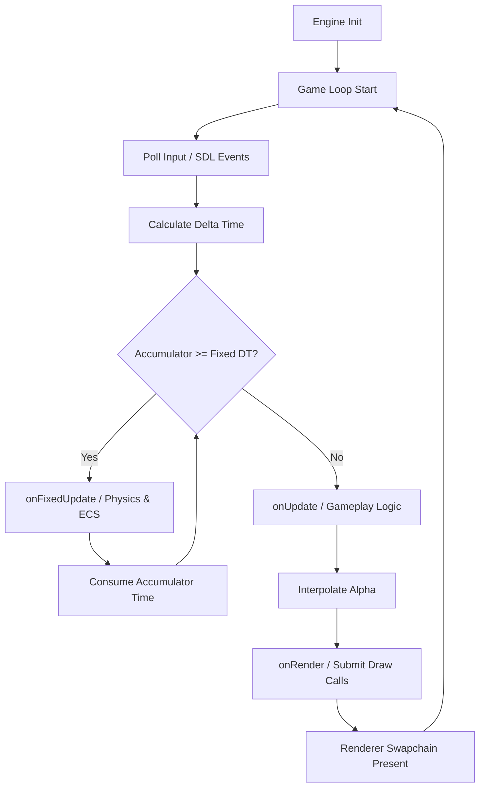
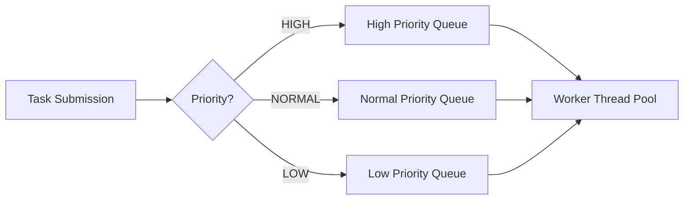
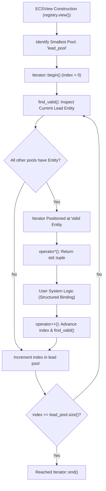
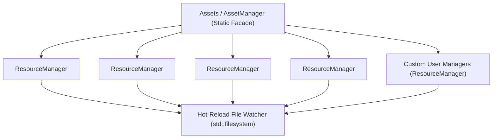
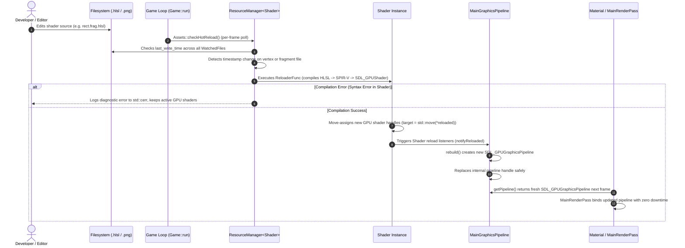
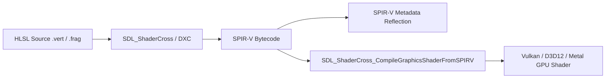
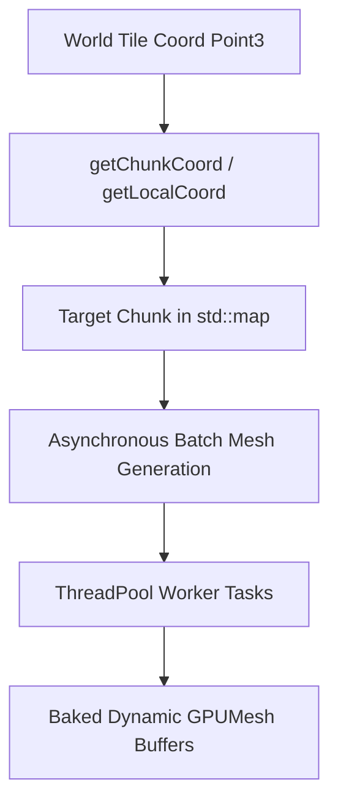

# Lili2D Engine Architecture & Systems Walkthrough

Welcome to the technical architectural overview of **Lili2D**, a high-performance 2D game engine built with **C++20** and **SDL3 / SDL_GPU**.

This document details the core system designs, concurrency patterns, memory layouts, transform pipelines, and GPU optimization strategies implemented across the engine. It serves as an in-depth reference for engine architects, technical leads, and developers.

---

## Table of Contents

1. [Engine Core & The Game Loop](#1-engine-core--the-game-loop)
2. [Priority-Scheduled Multithreading (`ThreadPool`)](#2-priority-scheduled-multithreading-threadpool)
3. [Data-Oriented Entity Component System (ECS)](#3-data-oriented-entity-component-system-ecs)
4. [Unified Scoped Asset & Resource Engine](#4-unified-scoped-asset--resource-engine)
5. [Live Asset & Shader Hot-Reloading Architecture](#5-live-asset--shader-hot-reloading-architecture)
6. [UI Layout Engine & Matrix Transform Pipeline](#6-ui-layout-engine--matrix-transform-pipeline)
7. [Virtual Viewport Scaling & Logical Resolution](#7-virtual-viewport-scaling--logical-resolution)
8. [Spatial Physics & Collision Query Subsystem](#8-spatial-physics--collision-query-subsystem)
9. [Hardware Rendering & GPU Memory Optimizations](#9-hardware-rendering--gpu-memory-optimizations)
10. [Custom Shader Cross-Compilation & Dynamic Uniform Buffering](#10-custom-shader-cross-compilation--dynamic-uniform-buffering)
11. [Input Action Mapping Subsystem (`ActionMap`)](#11-input-action-mapping-subsystem-actionmap)
12. [Chunk-Based 3D Grid Tilemap & Asynchronous Meshing](#12-chunk-based-3d-grid-tilemap--asynchronous-meshing)
13. [Frame Animation Pipeline & Sprite Slicing (`AtlasMap`, `AnimationPlayer`)](#13-frame-animation-pipeline--sprite-slicing-atlasmap-animationplayer)
14. [Modern C++20 Standards & Low-Latency Guidelines](#14-modern-c20-standards--low-latency-guidelines)

---

## 1. Engine Core & The Game Loop

Lili2D centers around a synchronized fixed-timestep game loop that decouples deterministic physics updates (TPS) from variable rendering framerates (FPS) using an accumulator pattern.


```mermaid
graph TD
    A[Engine Init] --> B[Game Loop Start]
    B --> C[Poll Input / SDL Events]
    C --> D[Calculate Delta Time]
    D --> E{Accumulator >= Fixed DT?}
    E -- Yes --> F[onFixedUpdate / Physics & ECS]
    F --> G[Consume Accumulator Time]
    G --> E
    E -- No --> H[onUpdate / Gameplay Logic]
    H --> I[Interpolate Alpha]
    I --> J[onRender / Submit Draw Calls]
    J --> K[Renderer Swapchain Present]
    K --> B
```

### Core Architecture Highlights

* **Decoupled Simulation & Render Interpolation**: Subclasses of `lili::Game` implement `onFixedUpdate()` for tick-rate deterministic state updates, and `onRender(alpha)` for smooth, frame-rate independent visual interpolation.
* **RAII & Encapsulated Subsystems**: Low-level subsystem lifecycles (`Window`, `Renderer`, `ThreadPool`, `SceneManager`) are strictly owned by `Game`. Subsystem handles are exposed via read-only accessors to protect state invariants.
* **Global Runtime Bridge (`GameConfig`)**: Provides a centralized state manager for runtime window mode toggles (fullscreen, borderless, resizable, relative mouse) synced safely back to the active `Game` instance.

---

## 2. Priority-Scheduled Multithreading (`ThreadPool`)

To maximize multi-core CPU utilization while eliminating frame-pacing stutter, Lili2D provides a custom C++20 task scheduler (`lili::ThreadPool`) featuring explicit **task prioritization**.

### Concurrency Mechanics

* **Fixed Thread Allocation**: Worker threads default to `std::thread::hardware_concurrency() - 1`, preserving one dedicated core for OS scheduling and the main engine loop.
* **RAII Lifecycle & Cooperative Cancellation**: Worker threads run via `std::jthread` and monitor `std::stop_token` for clean thread-group tear-downs.
* **Priority-Based Task Queues**: Tasks are submitted with a `TaskPriority` enum (`HIGH`, `NORMAL`, `LOW`):
  * **HIGH**: Frame-critical tasks (parallel ECS physics, collision dispatch, camera updates).
  * **NORMAL**: Asynchronous asset decoding, geometry processing.
  * **LOW**: Background world generation, tilemap chunk mesh baking.


```mermaid
graph LR
    Sub[Task Submission] --> P{Priority?}
    P -- HIGH --> HQ[High Priority Queue]
    P -- NORMAL --> NQ[Normal Priority Queue]
    P -- LOW --> LQ[Low Priority Queue]
    HQ --> W[Worker Thread Pool]
    NQ --> W
    LQ --> W
```

```cpp
// Worker threads drain queues in strict priority order: HIGH -> NORMAL -> LOW
auto& q = !high_tasks.empty()   ? high_tasks
        : !normal_tasks.empty() ? normal_tasks
                                : low_tasks;
task = std::move(q.front());
q.pop();
```

---

## 3. Data-Oriented Entity Component System (ECS)

Lili2D implements a cache-friendly Entity Component System (`lili::ECSRegistry`) designed around contiguous memory layouts and data-oriented design (DOD).

### Contiguous Memory Allocation (`ComponentPool<T>`)

Components of type `T` are stored sequentially in tightly packed arrays (`std::vector<T>`). When ECS systems execute, CPU L1/L2 data caches prefetch contiguous component slices, eliminating pointer-chasing and cache miss penalties inherent to traditional OOP hierarchies.

```txt
[ComponentPool<Position>] -> [ Pos0 ][ Pos1 ][ Pos2 ][ Pos3 ]  <-- (Packed Contiguous Block)
[ComponentPool<Velocity>] -> [ Vel0 ][ Vel1 ][ Vel2 ][ Vel3 ]  <-- (Packed Contiguous Block)
```

### Multi-Component Query Engine & Custom Iterator (`ECSView`)

Lili2D queries entities possessing combinations of components via `lili::ECSView<Components...>`, backed by a custom C++20 forward iterator (`ECSView::Iterator`) with zero heap allocation.


```mermaid
graph TD
    V["ECSView Construction (registry.view<T...>())"] --> LP["Identify Smallest Pool: 'lead_pool'"]
    LP --> ItInit["Iterator::begin() (index = 0)"]
    ItInit --> FV["find_valid(): Inspect Current Lead Entity"]
    FV --> Chk{"All other pools have Entity?"}
    Chk -- No --> Inc["Increment index in lead pool"]
    Inc --> Bounds{"index >= lead_pool.size()?"}
    Bounds -- No --> FV
    Bounds -- Yes --> End["Reached Iterator::end()"]
    Chk -- Yes --> Ready["Iterator Positioned at Valid Entity"]
    Ready --> Deref["operator*(): Return std::tuple<Entity, Components&...>"]
    Deref --> User["User System Logic (Structured Binding)"]
    User --> Next["operator++(): Advance index & find_valid()"]
    Next --> Inc
```

#### 1. Smallest Pool Heuristic ("Lead Pool")

The set of matching entities ($E_{\text{match}}$) is an intersection across all queried component pools:

$$E_{\text{match}} = E_{C_1} \cap E_{C_2} \cap \dots \cap E_{C_n} \implies \text{count}(E_{\text{match}}) \le \min_{i}(\text{count}(E_{C_i}))$$

`ECSView` identifies the smallest pool (`lead_pool`) via fold expressions at construction. Iteration candidate space is constrained strictly to the lead pool, eliminating full traversals of larger pools.

#### 2. Short-Circuit Filtering & Direct Array Indexing

* **Fold Short-Circuiting (`find_valid`)**: `((pool == lead_pool || pool->has(current_entity)) && ...)` short-circuits on the first missing component.
* **Lead Fast-Path**: The lead pool candidate avoids sparse-set lookups entirely via identity check `pool == lead_pool`.
* **Zero-Copy Dereference (`operator*`)**: Returns `std::tuple<Entity, Components&...>`. The lead component is fetched via direct O(1) contiguous index `lead_pool->getComponents()[index]`, while secondary pools use sparse lookups.

```cpp
// In-place mutation over contiguous component memory with structured bindings
for (auto [entity, pos, vel, render] : registry.view<Position, Velocity, Render>()) {
    pos.value += vel.value * dt; // Direct in-place pool modification, zero heap alloc
}
```

### Thread-Safe Deferred Command Buffer

Modifying ECS state (spawning/destroying entities, attaching components) during multithreaded execution creates data races. Lili2D provides `lili::CommandBuffer`:
1. Worker threads query components concurrently and enqueue structural mutations to thread-safe deferred queues.
2. At frame tick completion, the main thread flushes `CommandBuffer` sequentially into `ECSRegistry`, guaranteeing lock-free system updates.

---

## 4. Unified Scoped Asset & Resource Engine

Asset management in Lili2D is powered by a dual-tier architecture: templated scoped resource managers (`lili::ResourceManager<T>`) and a centralized static facade (`lili::AssetManager` / `lili::Assets`).


```mermaid
graph TD
    Facade["Assets / AssetManager (Static Facade)"]
    Facade --> TexMgr["ResourceManager<Texture>"]
    Facade --> ShdMgr["ResourceManager<Shader>"]
    Facade --> FntMgr["ResourceManager<BitmapFont>"]
    Facade --> AtlMgr["ResourceManager<AtlasMap>"]
    Facade --> CustMgr["Custom User Managers (ResourceManager<T>)"]
    
    TexMgr --> HR["Hot-Reload File Watcher (std::filesystem)"]
    ShdMgr --> HR
    FntMgr --> HR
    AtlMgr --> HR
    CustMgr --> HR
```

### Key Design Patterns

* **Polymorphic Base Interface (`IResourceManager`)**: Type-erased base class enabling uniform lifecycle control, scope unloading, and hot-reload polling across heterogeneous resource types.
* **Scoped Memory Isolation (`unloadScope`)**: Resources are assigned scope tags (e.g. `"global"`, `"main_menu"`, `"level_01"`). Calling `Assets::unloadScope("level_01")` purges all unused textures, fonts, and shaders associated with that scene, preventing memory leaks during scene transitions.
* **Extensible Type Registry**: Custom user asset types `T` can be registered dynamically via `Assets::getManager<T>()`, granting them full caching, scope control, and hot-reloading capabilities.

---

## 5. Live Asset & Shader Hot-Reloading Architecture

Lili2D implements an asynchronous, multi-stage hot-reloading pipeline that allows developers to modify textures, fonts, sprite sheets, and custom HLSL shaders (`.vert.hlsl` / `.frag.hlsl`) on disk while the game is running, updating GPU state in real-time without application restarts.


```mermaid
sequenceDiagram
    autonumber
    actor Dev as Developer / Editor
    participant Disk as Filesystem (.hlsl / .png)
    participant GameLoop as Game Loop (Game::run)
    participant RM as ResourceManager<Shader>
    participant S as Shader Instance
    participant P as MainGraphicsPipeline
    participant M as Material / MainRenderPass

    Dev->>Disk: Edits shader source (e.g. rect.frag.hlsl)
    GameLoop->>RM: Assets::checkHotReload() (per-frame poll)
    RM->>Disk: Checks last_write_time across all WatchedFiles
    RM->>RM: Detects timestamp change on vertex or fragment file
    RM->>S: Executes ReloaderFunc (compiles HLSL -> SPIR-V -> SDL_GPUShader)
    alt Compilation Error (Syntax Error in Shader)
        RM-->>Dev: Logs diagnostic error to std::cerr, keeps active GPU shaders
    else Compilation Success
        S->>S: Move-assigns new GPU shader handles (target = std::move(*reloaded))
        S->>P: Triggers Shader reload listeners (notifyReloaded)
        P->>P: rebuild() creates new SDL_GPUGraphicsPipeline
        P->>P: Replaces internal pipeline handle safely
        M->>P: getPipeline() returns fresh SDL_GPUGraphicsPipeline next frame
        M->>M: MainRenderPass binds updated pipeline with zero downtime
    end
```

### Key Mechanisms

* **Multi-File Tracking (`WatchedFile`)**: Compound assets (e.g., shaders requiring both `.vert.hlsl` and `.frag.hlsl`) store arrays of `WatchedFile`. If any dependency timestamp changes, the reloader triggers and syncs all timestamps simultaneously upon success.
* **Observer Pipeline Rebuilding**: Modern GPU pipeline state objects (`SDL_GPUGraphicsPipeline`) are immutable. Pipelines subscribe to `Shader` reload events via `notifyReloaded()`, triggering `MainGraphicsPipeline::rebuild()`. `Material` dynamically queries `getPipeline()`, eliminating manual re-binding in gameplay code.
* **Resilient Exception Guards**: Shader recompilation is wrapped in exception handlers. Compilation errors log diagnostics to `std::cerr` and leave current GPU pipelines untouched, allowing uninterrupted gameplay while fixing syntax errors.

---

## 6. UI Layout Engine & Matrix Transform Pipeline

All rendered 2D objects inherit from `lili::IRenderable`, establishing a unified interface for positions, scales, rotations, materials, and UI layout positioning.

### UI Pivot & Anchor Normalization

Lili2D features a coordinate-independent UI positioning pipeline based on normalized **Anchors** (screen/viewport relative) and **Pivots** (element bounding box relative):

$$\text{GlobalPos} = (\text{ViewportSize} \times \text{Anchor}) + \text{Offset} - (\text{ObjSize} \times \text{Pivot})$$

### 3x3 Affine Matrix Transformation (`Mat3`)

Renderables compose a 3x3 transformation matrix combining translation, pivot shifts, scale factors, and 2D rotation:

$$M = T(\text{Position} + \text{AnchorOffset}) \times R(\theta) \times S(\text{Scale}) \times T(-\text{PivotOffset})$$

```cpp
Mat3 transform = Mat3::translation(screen_pos) *
                 Mat3::rotation(rotation_rad) *
                 Mat3::scale(scale) *
                 Mat3::translation(-pivot_offset);
```

### Inverse-Matrix Point Containment (`containsPoint`)

To test if screen/mouse coordinates hit a transformed element, `containsPoint()` multiplies the point by the **inverse** transformation matrix ($M^{-1}$), transforming coordinates into local unrotated element space for exact bounding box evaluation.

---

## 7. Virtual Viewport Scaling & Logical Resolution

To protect game logic and UI layouts from physical display resolution changes, window resizing, and aspect ratio variations, Lili2D provides a **Logical Resolution** subsystem (`Window::setLogicalResolution`).

### Aspect-Ratio Aware Letterboxing

The engine computes scale factors and centers the game viewport within physical window dimensions using dynamic pillarboxing or letterboxing:

$$\text{Scale} = \min\left(\frac{\text{PhysicalWidth}}{\text{LogicalWidth}}, \frac{\text{PhysicalHeight}}{\text{LogicalHeight}}\right)$$

### Coordinate Space Mapping (`toLogicalCoords`)

Input events (mouse cursor coordinates, touch points) recorded in physical screen pixels are transformed into logical game space automatically:

$$\text{LogicalPos} = \frac{\text{PhysicalPos} - \text{ViewportOffset}}{\text{Scale}}$$

---

## 8. Spatial Physics & Collision Query Subsystem

Lili2D provides lightweight spatial primitive colliders for 2D gameplay physics, raycasting, and broad-phase/narrow-phase queries.

### Collision Primitives & Math

* **`AABB2` / `AABB3`**: Axis-Aligned Bounding Boxes with `min` and `max` vectors for broad-phase bounding hierarchies and hitboxes.
* **`CircleCollider`**: Precise circle-to-circle, circle-to-box, and circle-to-line segment collision solver.

```cpp
// Circle-to-AABB clamp narrow-phase intersection
Vec2 closest = { std::clamp(circle.center.x, aabb.min.x, aabb.max.x),
                 std::clamp(circle.center.y, aabb.min.y, aabb.max.y) };
bool hit = (circle.center - closest).lengthSquared() <= (circle.radius * circle.radius);
```

### Zero-Allocation Primitive & Debug Visualization

Colliders do not render themselves directly. Instead, colliders expose a `.getShape()` method that returns lightweight geometric primitives (`RectShape`, `CircleShape`), which can be submitted directly to the `Renderer`'s cached shape drawing API (`drawRect`, `drawCircle`, `drawLine`):

```cpp
// Prototyping / debug visualization using cached shape rendering:
renderer->drawRect(aabb.getShape(), debug_color, /*hollow=*/true);
renderer->drawCircle(circle_collider.getShape(), debug_color, /*hollow=*/true);
renderer->drawLine(start, end, debug_color, thickness);
```

The `Renderer` uses an internal `ShapesCache` (PIMPL) retaining shared primitives and materials keyed by color and fill mode. This eliminates heap allocations during frame steps and allows rapid game prototyping without creating texture assets.

---

## 9. Hardware Rendering & GPU Memory Optimizations

Lili2D relies on SDL3's `SDL_GPU` abstraction layer for direct modern graphics hardware execution (Vulkan, Direct3D 12, Metal).

### Camera Viewport Frustum Culling

Before submitting tilemap geometry to GPU command buffers, the `TileMap` culls all chunks lying outside the active `Camera` viewport bounds calculated via inverse camera zoom/translation matrices. Chunks outside camera AABB boundaries skip mesh updates and draw submissions entirely.

### Automated Texture Batching (`SpriteBatch`)

To prevent driver bottlenecks caused by repetitive GPU draw call submissions, Lili2D groups sprites sharing identical texture bindings and render passes into a unified `SpriteBatch`. Sprite vertices and indices are merged into single dynamic buffers and rendered in a single `SDL_DrawGPUIndexedPrimitives` draw call.

### Dynamic Rebuild Budgeting

Rebuilding hundreds of chunks in a single frame during rapid camera motion would exhaust command queues and cause stutter. Lili2D enforces a strict chunk rebuild budget of **8 chunks per frame tick**:

```cpp
if (chunk.dirty && rebuilds_this_frame < 8) {
    rebuilds_this_frame++;
    chunk.rebuildBatches(renderer, thread_pool, chunk_pos, tile_size);
}
```

Excess dirty chunks are deferred and progressively updated across subsequent frames.

### GPU Idle Synchronization & Deleter Protections

To eliminate hardware race conditions and Vulkan descriptor validation errors (`VUID-VkWriteDescriptorSet-descriptorType-02997`) during resource reloads or scene teardowns:
* **RAII GPU Deleters**: Device-dependent deleters (`SDLGPUTextureDeleter`, `SDLGPUBufferDeleter`, etc.) invoke `SDL_WaitForGPUIdle(device)` before releasing GPU memory.
* **Renderer Shutdown Synchronization**: `Renderer::~Renderer()` idles the active GPU device prior to freeing pipelines, shaders, or mesh allocations.
* **Defensive Render Pass Validation**: `MainRenderPass::render()` verifies vertex/index buffers and textures are non-null before binding, skipping incomplete assets gracefully during hot-reloads.

---

## 10. Custom Shader Cross-Compilation & Dynamic Uniform Buffering

Lili2D unifies shader authoring around **HLSL** as the canonical shading language, transpiling and cross-compiling shaders dynamically to the active backend driver via `SDL_ShaderCross`.


```mermaid
graph LR
    HLSL[HLSL Source .vert / .frag] --> DXC[SDL_ShaderCross / DXC]
    DXC --> SPIRV[SPIR-V Bytecode]
    SPIRV --> Refl[SPIR-V Metadata Reflection]
    SPIRV --> GPUComp[SDL_ShaderCross_CompileGraphicsShaderFromSPIRV]
    GPUComp --> Backend[Vulkan / D3D12 / Metal GPU Shader]
```

### Direct Uniform Push Architecture

Lili2D leverages SDL3 GPU's immediate command buffer uniform push model rather than allocating persistent descriptor uniform buffers per draw call:
* **Vertex Slot 0 (Engine Uniforms)**: MVP matrix (3x4 columns), tint color (`Vec4`), UV bounds (`Vec4`), render layer, and elapsed engine time.
* **Vertex Slot 1 & Fragment Slot 0 (Custom User Uniforms)**: Arbitrary user-defined structs pushed directly into the command buffer stream via `material.setVertexUniforms(data)` and `material.setFragmentUniforms(data)`.

```cpp
struct WaveUniforms { float time, amplitude, frequency, speed; };
rect.getMaterial()->setVertexUniforms(WaveUniforms{ clock.getTime(), 0.2f, 30.0f, 5.0f });
```

---

## 11. Input Action Mapping Subsystem (`ActionMap`)

The centralized `lili::ActionMap` decouples game logic from physical hardware input devices using string-keyed logical actions:

```cpp
ActionMap::get().add("Jump", { Key::SPACE, Key::W });
ActionMap::get().add("Shoot", {}, { MouseButton::LEFT });
```

### Tri-State Frame Queries

The action map processes input transitions per frame, allowing systems to query discrete input states:
* `isHeld("MoveRight")`: Returns `true` continuously while any assigned physical key/button is depressed.
* `isJustPressed("Jump")`: Returns `true` strictly on the exact frame the action was activated.
* `isJustReleased("Shoot")`: Returns `true` strictly on the frame the action was released.

---

## 12. Chunk-Based 3D Grid Tilemap & Asynchronous Meshing

Lili2D's world tilemap system (`lili::TileMap`) is architected for expansive grid-based environments using 3D chunk spatial partitioning (`Point3(chunkX, chunkY, layerZ)`).


```mermaid
graph TD
    WorldPos[World Tile Coord Point3] --> Hash[getChunkCoord / getLocalCoord]
    Hash --> Chunk[Target Chunk in std::map]
    Chunk --> Batch[Asynchronous Batch Mesh Generation]
    Batch --> TP[ThreadPool Worker Tasks]
    TP --> GPUMesh[Baked Dynamic GPUMesh Buffers]
```

### Key Architectural Mechanisms:
* **Spatial Chunk Indexing**: Coordinates are partitioned into fixed chunks (e.g. 16x16 tiles) indexed via `Point3Compare`.
* **Asynchronous Geometry Baking**: When tiles mutate (`setTile`), dirty chunks dispatch geometry generation to `ThreadPool` workers, generating vertex and index lists in parallel without stalling the main thread.
* **Layer Depth & Collision Sweep**: `checkCollision(AABB3)` queries solid tile IDs directly within relevant local chunk coordinates, testing bounding box overlaps without inspecting air tiles.

---

## 13. Frame Animation Pipeline & Sprite Slicing (`AtlasMap`, `AnimationPlayer`)

Lili2D handles 2D sprite animations through a decoupled animation model comprising `AtlasMap`, `AnimationRegistry`, and `AnimationPlayer`.

### Sub-Texture UV Slicing (`AtlasMap`)

Spritesheets are sliced into uniform grid cells (`slice(cols, rows)`). The engine computes normalized UV bounding coordinates for each frame:

$$\text{UV}_{\min} = \left(\frac{\text{col}}{\text{Cols}}, \frac{\text{row}}{\text{Rows}}\right), \quad \text{UV}_{\max} = \left(\frac{\text{col} + 1}{\text{Cols}}, \frac{\text{row} + 1}{\text{Rows}}\right)$$

### Playback & Event Hooks (`AnimationPlayer`)

* **Normalized Frame Accumulation**: `AnimationPlayer` accumulates delta time against `frame_duration`, advancing the active frame index and wrapping according to `LoopMode` (`Loop`, `Once`, `PingPong`).
* **Frame Callbacks**: Custom events (footstep SFX, attack hitboxes, projectile spawning) can be hooked to specific animation frame indices via `onFrame(frame_idx, callback)`.

---

## 14. Modern C++20 Standards & Low-Latency Guidelines

Lili2D enforces strict C++20 design patterns across all engine subsystems to guarantee maximum instruction throughput, zero static initialization latency, and ABI-level hardware register utilization.

### Architecture Guidelines Summary

| Guideline & Standard | Applied Engine Subsystems | Low-Latency / Architectural Rationale |
| :--- | :--- | :--- |
| **Pass-by-Value (<= 16B PODs)** | `Vec2`, `Vec3`, `Vec4`, `Point2/3`, `RectShape`, `CircleShape`, `Entity` | Passed directly in hardware vector/integer registers (`XMM0-XMM7` on System V x86-64, `v0-v7` on ARM64). Guarantees **zero pointer aliasing**, enabling aggressive instruction reordering and auto-vectorization. |
| **Targeted Header Inlining** | `lili::geometry`, `lili::physics`, math operators, easing curves, fast property accessors | Inlines hot per-frame leaf functions into calling translation units for constant folding and dead-code elimination. Heavy object constructors and singletons (`TileRegistry`, `AssetManager`) remain source-separated (`.cpp`) to prevent compilation bloat. |
| **`constexpr` Constructors** | Geometric primitives (`VecN`, `PointN`, `RectShape`, `CircleShape`), `CircleCollider`, `Clock` | Promotes types to **Literal Types**, allowing compile-time layout validation (`static_assert`) and baking static constants (`Vec2::ZERO`, `Mat3::IDENTITY`) directly into `.rodata`, completely eliminating the **Static Initialization Order Fiasco (SIOF)**. |
| **`[[nodiscard]]` Safety Enforcement** | Pure input queries (`Keyboard::justPressed`), time stepping (`Clock::step()`), immutable math transforms (`operator+`, `getAABB`) | Emits compile-time diagnostics (`-Wunused-result`) when callers drop progress-tracking return values or calculate out-of-place transforms without assigning the result. |
| **`noexcept` Move Invariants** | Move constructors / assignment operators on all RAII resources (`GPUMesh`, `Shader`, `Texture`, `Window`, `Pipeline`) | Satisfies `std::move_if_noexcept`, guaranteeing `std::vector` reallocations perform O(1) in-place pointer swaps rather than deep copies. Strips exception landing pads (`.eh_frame`) from leaf math binaries. |

### Concrete Code Contracts

```cpp
// 1. Compile-time validation of geometry & collision invariants
constexpr CircleCollider collider{Vec2{0.0f, 0.0f}, 15.0f};
static_assert(collider.contains(Vec2{5.0f, 5.0f}), "Collision math must be valid at compile-time!");

// 2. Guaranteed noexcept move semantics on RAII GPU wrappers
GPUMesh(GPUMesh&& other) noexcept = default;
GPUMesh& operator=(GPUMesh&& other) noexcept = default;

// 3. Structured bindings and value passing in hot loops
for (auto [entity, pos, vel] : registry.view<Position, Velocity>()) {
    pos.value += vel.value * dt; // Operates in-place on packed memory
}
```
