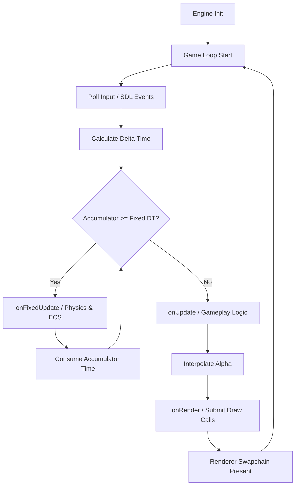
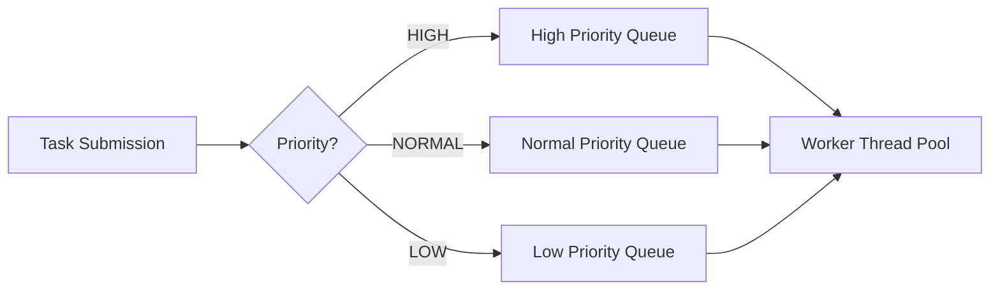
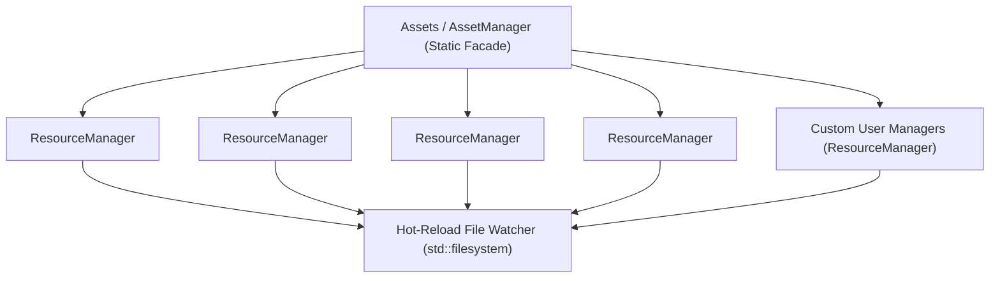

# Lili2D Engine Architecture & Systems Walkthrough

Welcome to the technical architectural overview of **Lili2D**, a high-performance 2D game engine built with **C++20** and **SDL3 / SDL_GPU**.

This document details the core system designs, concurrency patterns, memory layouts, transform pipelines, and GPU optimization strategies implemented across the engine. It serves as an in-depth reference for engine architects, technical leads, and developers.

---

## 1. Engine Core & The Game Loop

Lili2D centers around a synchronized fixed-timestep game loop that decouples deterministic physics updates (TPS) from variable rendering framerates (FPS) using an accumulator pattern.


```mermaid
graph TD
    A[Engine Init] --> B[Game Loop Start]
    B --> C[Poll Input / SDL Events]
    C --> D[Calculate Delta Time]
    D --> E{Accumulator >= Fixed DT?}
    E -- Yes --> F[onFixedUpdate / Physics & ECS]
    F --> G[Consume Accumulator Time]
    G --> E
    E -- No --> H[onUpdate / Gameplay Logic]
    H --> I[Interpolate Alpha]
    I --> J[onRender / Submit Draw Calls]
    J --> K[Renderer Swapchain Present]
    K --> B
```

### Core Architecture Highlights

* **Decoupled Simulation & Render Interpolation**: Subclasses of `lili::Game` implement `onFixedUpdate()` for tick-rate deterministic state updates, and `onRender(alpha)` for smooth, frame-rate independent visual interpolation.
* **RAII & Encapsulated Subsystems**: Low-level subsystem lifecycles (`Window`, `Renderer`, `ThreadPool`, `SceneManager`) are strictly owned by `Game`. Subsystem handles are exposed via read-only accessors to protect state invariants.
* **Global Runtime Bridge (`GameConfig`)**: Provides a centralized state manager for runtime window mode toggles (fullscreen, borderless, resizable, relative mouse) synced safely back to the active `Game` instance.

---

## 2. Priority-Scheduled Multithreading (`ThreadPool`)

To maximize multi-core CPU utilization while eliminating frame-pacing stutter, Lili2D provides a custom C++20 task scheduler (`lili::ThreadPool`) featuring explicit **task prioritization**.

### Concurrency Mechanics

* **Fixed Thread Allocation**: Worker threads default to `std::thread::hardware_concurrency() - 1`, preserving one dedicated core for OS scheduling and the main engine loop.
* **RAII Lifecycle & Cooperative Cancellation**: Worker threads run via `std::jthread` and monitor `std::stop_token` for clean thread-group tear-downs.
* **Priority-Based Task Queues**: Tasks are submitted with a `TaskPriority` enum (`HIGH`, `NORMAL`, `LOW`):
  * **HIGH**: Frame-critical tasks (parallel ECS physics, collision dispatch, camera updates).
  * **NORMAL**: Asynchronous asset decoding, geometry processing.
  * **LOW**: Background world generation, tilemap chunk mesh baking.


```mermaid
graph LR
    Sub[Task Submission] --> P{Priority?}
    P -- HIGH --> HQ[High Priority Queue]
    P -- NORMAL --> NQ[Normal Priority Queue]
    P -- LOW --> LQ[Low Priority Queue]
    HQ --> W[Worker Thread Pool]
    NQ --> W
    LQ --> W
```

```cpp
// Task selection routine executed by worker threads
if (!high_tasks.empty()) {
    task = std::move(high_tasks.front());
    high_tasks.pop();
} else if (!normal_tasks.empty()) {
    task = std::move(normal_tasks.front());
    normal_tasks.pop();
} else if (!low_tasks.empty()) {
    task = std::move(low_tasks.front());
    low_tasks.pop();
}
```

---

## 3. Data-Oriented Entity Component System (ECS)

Lili2D implements a cache-friendly Entity Component System (`lili::ECSRegistry`) designed around contiguous memory layouts and data-oriented design (DOD).

### Contiguous Memory Allocation (`ComponentPool<T>`)

Components of type `T` are stored sequentially in tightly packed arrays (`std::vector<T>`). When ECS systems execute, CPU L1/L2 data caches prefetch contiguous component slices, eliminating pointer-chasing and cache miss penalties inherent to traditional OOP hierarchies.

```txt
[ComponentPool<Position>] -> [ Pos0 ][ Pos1 ][ Pos2 ][ Pos3 ]  <-- (Packed Contiguous Block)
[ComponentPool<Velocity>] -> [ Vel0 ][ Vel1 ][ Vel2 ][ Vel3 ]  <-- (Packed Contiguous Block)
```

### Thread-Safe Deferred Command Buffer

Modifying ECS structures (spawning entities, attaching components, deleting entities) during multithreaded system execution creates critical data races. 

Lili2D resolves this using a deferred **Command Buffer** pattern:

1. Worker threads query components concurrently and submit structural mutation commands to `lili::CommandBuffer`.
2. Commands are accumulated in thread-safe deferred queues.
3. At the end of the frame tick, the main thread flushes `CommandBuffer` operations sequentially into `ECSRegistry`, guaranteeing lock-free system execution.

---

## 4. Unified Scoped Asset & Resource Engine

Asset management in Lili2D is powered by a dual-tier architecture: templated scoped resource managers (`lili::ResourceManager<T>`) and a centralized static facade (`lili::AssetManager` / `lili::Assets`).


```mermaid
graph TD
    Facade["Assets / AssetManager (Static Facade)"]
    Facade --> TexMgr["ResourceManager<Texture>"]
    Facade --> ShdMgr["ResourceManager<Shader>"]
    Facade --> FntMgr["ResourceManager<BitmapFont>"]
    Facade --> AtlMgr["ResourceManager<AtlasMap>"]
    Facade --> CustMgr["Custom User Managers (ResourceManager<T>)"]
    
    TexMgr --> HR["Hot-Reload File Watcher (std::filesystem)"]
    ShdMgr --> HR
    FntMgr --> HR
    AtlMgr --> HR
    CustMgr --> HR
```

### Key Design Patterns

* **Polymorphic Base Interface (`IResourceManager`)**: Type-erased base class enabling uniform lifecycle control, scope unloading, and hot-reload polling across heterogeneous resource types.
* **Scoped Memory Isolation (`unloadScope`)**: Resources are assigned scope tags (e.g. `"global"`, `"main_menu"`, `"level_01"`). Calling `Assets::unloadScope("level_01")` purges all unused textures, fonts, and shaders associated with that scene, preventing memory leaks during scene switches.
* **Live Filesystem Hot-Reloading & In-Place GPU Updates**: Automatically polls file modification timestamps (`std::filesystem::last_write_time`). When an asset on disk is modified:
  * Reloads are wrapped in exception guards to safely handle transient disk I/O states (e.g. an external editor truncating and writing a file mid-save).
  * `AtlasMap` and `BitmapFont` move-assignments update internal GPU textures in-place (`*full_texture = std::move(*other.full_texture)`), maintaining stable heap memory addresses so active `AnimatedSprite` and `Material` objects remain valid across reloads without dangling pointers.
  * GPU resource replacements synchronize via `SDL_WaitForGPUIdle`, preventing in-flight Vulkan command buffer races and `VK_NULL_HANDLE` descriptor set validation errors.
* **Extensible Type Registry**: Custom user asset types `T` can be registered dynamically via `Assets::getManager<T>()`, granting them full caching, scope control, and hot-reloading capabilities.

---

## 5. UI Layout Engine & Matrix Transform Pipeline

All rendered 2D objects inherit from `lili::IRenderable`, establishing a unified interface for positions, scales, rotations, materials, and UI layout positioning.

### UI Pivot & Anchor Normalization

Lili2D features a coordinate-independent UI positioning pipeline based on normalized **Anchors** (screen/viewport relative) and **Pivots** (element bounding box relative).

* **Anchor**: Position relative to the active screen viewport (e.g. `TopLeft` `(0,0)`, `Center` `(0.5,0.5)`, `BottomRight` `(1,1)`).
* **Pivot**: Alignment origin inside the element's bounding rect (e.g. `Center` aligns rotation and translation to the element's mid-point).

$$\text{GlobalPos} = (\text{ViewportSize} \odot \vec{A}) + \vec{\text{Offset}} - (\text{ObjSize} \odot \vec{P})$$

### 3x3 Affine Matrix Transformation (`Mat3`)

Renderables construct a 3x3 transformation matrix combining translation, pivot shifts, scale factors, and 2D rotation:

$$M = T(\text{Position} + \text{AnchorOffset}) \cdot R(\theta) \cdot S(\text{Scale}) \cdot T(-\text{PivotOffset})$$

```cpp
// Calculating 3x3 transformation matrix for UI layout rendering
Mat3 transform = Mat3::translation(screen_pos) *
                 Mat3::rotation(rotation_rad) *
                 Mat3::scale(scale) *
                 Mat3::translation(-pivot_offset);
```

### Inverse-Matrix Point Containment (`containsPoint`)

To test if a screen/mouse coordinate intersects a transformed renderable element, `containsPoint()` multiplies the point by the **inverse** transformation matrix $M^{-1}$, mapping the coordinate into local unrotated element space for exact bounding box collision.

---

## 6. Virtual Viewport Scaling & Logical Resolution

To protect game logic and UI layouts from physical display resolution changes, window resizing, and aspect ratio variations, Lili2D provides a **Logical Resolution** subsystem (`Window::setLogicalResolution`).

### Aspect-Ratio Aware Letterboxing

When logical resolution is enabled (e.g., `800x600`), the engine computes scale factors and centers the game viewport within physical window dimensions using dynamic pillarboxing or letterboxing:

$$\text{Scale} = \min\left(\frac{\text{Physical}_W}{\text{Logical}_W}, \frac{\text{Physical}_H}{\text{Logical}_H}\right)$$

### Coordinate Space Mapping (`toLogicalCoords`)

Input events (mouse cursor coordinates, touch points) recorded in physical screen pixels are transformed into logical game space automatically:

$$\vec{P}_{\text{logical}} = \frac{\vec{P}_{\text{physical}} - \vec{V}_{\text{offset}}}{\text{Scale}}$$

This ensures mouse interactions, UI hit tests, and gameplay logic operate strictly in logical game coordinates regardless of monitor DPI or window resizing.

---

## 7. Spatial Physics & Collision Query Subsystem

Lili2D provides lightweight spatial primitive colliders for 2D gameplay physics, raycasting, and broad-phase/narrow-phase queries.

### Collision Primitives & Math

* **`AABB2`**: Axis-Aligned Bounding Box for fast bounding volume hierarchies and rectangular hitboxes.
* **`CircleCollider`**: Precise circle-to-circle, circle-to-box, and circle-to-line segment collision solver.

```cpp
// Circle-to-AABB Intersection Algorithm
Vec2 closest_point = {
    std::clamp(circle.center.x, aabb.min.x, aabb.max.x),
    std::clamp(circle.center.y, aabb.min.y, aabb.max.y)
};
Vec2 distance_vec = circle.center - closest_point;
bool intersects = (distance_vec.lengthSquared() <= (circle.radius * circle.radius));
```

### Zero-Allocation Debug Visualization

All colliders include a `debugDraw(renderer, color)` method that submits debug outlines directly to the line rendering pipeline without triggering heap allocations during frame steps.

---

## 8. Hardware Rendering & GPU Memory Optimizations

Lili2D relies on SDL3's `SDL_GPU` abstraction layer for direct modern graphics hardware execution (Vulkan, Direct3D 12, Metal).

### Camera Viewport Frustum Culling

Before submitting tilemap geometry to GPU command buffers, the `TileMap` culls all chunks lying outside the active `Camera` viewport bounds:

* Viewport bounds are calculated in world space by taking screen dimensions and applying inverse camera zoom/translation matrices.
* Chunks outside camera AABB boundaries skip mesh building and draw submission entirely.

### Automated Texture Batching (`SpriteBatch`)

To prevent driver bottlenecks caused by repetitive GPU draw call submissions, Lili2D groups sprites sharing identical texture bindings and render passes into a unified `SpriteBatch`:

* Sprite quads are merged into a single dynamic vertex array.
* Index and vertex data are transferred to GPU VRAM in a single memory upload.
* The batch is rendered via a single `SDL_DrawGPUIndexedPrimitives` draw call.

### Dynamic Rebuild Budgeting

When moving through large tilemap worlds (e.g. `1500x1500` grid maps), camera movement can expose many dirty chunks simultaneously. Rebuilding and uploading GPU buffers for hundreds of chunks in a single frame would exhaust command queue ring buffers and stutter the frame rate.

Lili2D enforces a strict **chunk rebuild budget**:

* A maximum of **8 chunk rebuilds** are enqueued to worker threads per frame tick.
* Excess dirty chunks are queued and rebuilt progressively over subsequent frames.
* Ensures a stable framerate during rapid camera movement across large worlds.

```cpp
int rebuilds_this_frame = 0;
for (auto &pair : chunks) {
    if (chunk.dirty || chunk.rebuilding) {
        if (chunk.dirty) {
            if (rebuilds_this_frame >= 8) {
                continue; // Defer remaining chunk rebuilds to next frame
            }
            rebuilds_this_frame++;
        }
        chunk.rebuildBatches(renderer, thread_pool, chunk_pos, tile_size);
    }
}
```

### GPU Idle Synchronization & Deleter Protections

To eliminate hardware race conditions, GPU use-after-free, and Vulkan descriptor validation errors (`VUID-VkWriteDescriptorSet-descriptorType-02997`) during resource reloads or scene teardowns, Lili2D enforces strict GPU synchronization:

* **RAII GPU Deleters**: Smart deleters for all device-dependent handles (`SDLGPUTextureDeleter`, `SDLGPUSamplerDeleter`, `SDLGPUBufferDeleter`, `SDLGPUShaderDeleter`, `SDLGPUGraphicsPipelineDeleter`) call `SDL_WaitForGPUIdle(device)` before invoking `SDL_ReleaseGPU...`.
* **Renderer Teardown Synchronization**: `Renderer::~Renderer()` idles the active GPU device (`SDL_WaitForGPUIdle`) prior to destroying pipelines, shaders, or GPU meshes during engine shutdown.
* **Defensive Render Pass Validation**: `MainRenderPass::render()` checks that vertex buffers, index buffers, textures, and samplers are non-null before binding and drawing. If any GPU resource is temporarily unallocated or undergoing hot-reload, the pass skips the draw call gracefully for that frame tick rather than passing null handles to the driver.

