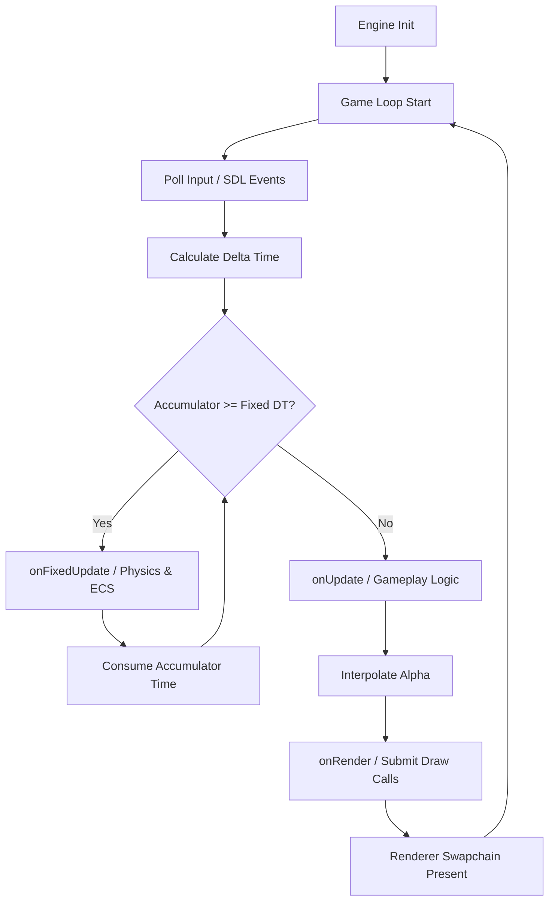
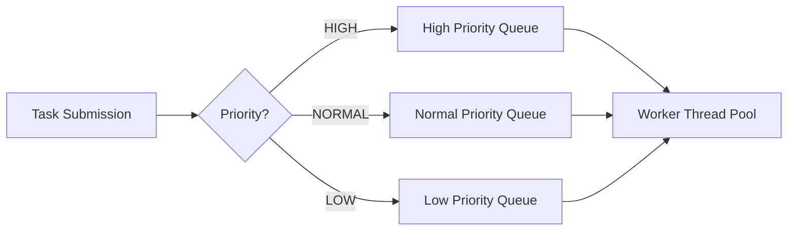
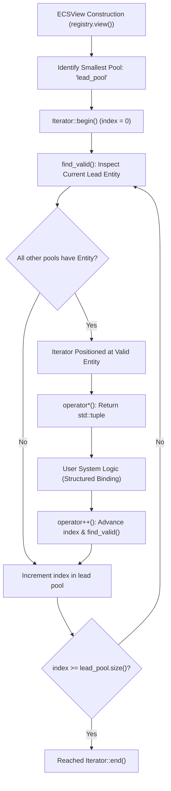
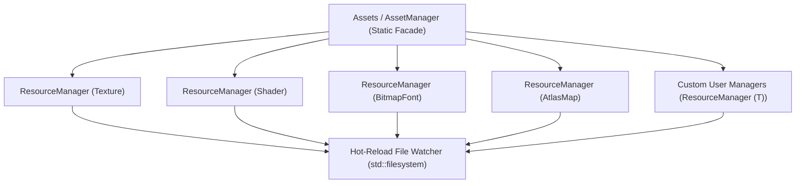
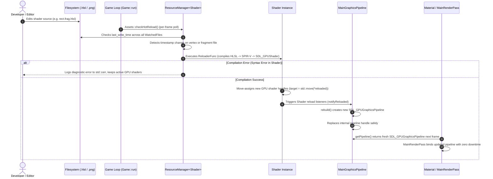
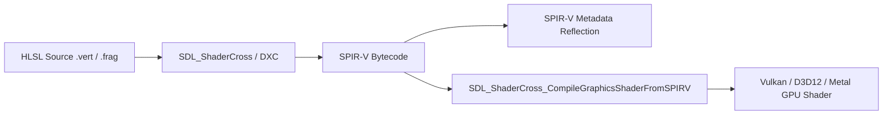
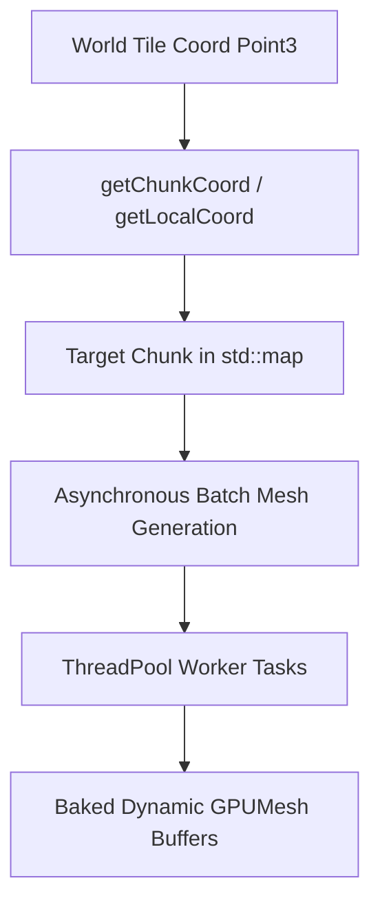

# Lili2D Engine Architecture

An overview of the core subsystems, memory layouts, and rendering pipeline in Lili2D.

---

## Table of Contents

1. [Engine Core & The Game Loop](#1-engine-core--the-game-loop)
2. [Multithreading (`ThreadPool`)](#2-multithreading-threadpool)
3. [Entity Component System (ECS)](#3-entity-component-system-ecs)
4. [Asset & Resource Engine](#4-asset--resource-engine)
5. [Live Asset & Shader Hot-Reloading](#5-live-asset--shader-hot-reloading)
6. [UI Layout Engine & Matrix Transform](#6-ui-layout-engine--matrix-transform)
7. [Viewport Scaling & Logical Resolution](#7-viewport-scaling--logical-resolution)
8. [Physics & Collision](#8-physics--collision)
9. [Rendering & GPU Memory](#9-rendering--gpu-memory)
10. [Custom Shader & Uniform Buffer](#10-custom-shader--uniform-buffer)
11. [Input Action Mapping](#11-input-action-mapping)
12. [3D Grid Tilemap & Meshing](#12-3d-grid-tilemap--meshing)
13. [Animation & Sprite Slicing](#13-animation--sprite-slicing)
14. [Modern C++ & Guidelines](#14-modern-c--guidelines)

---

## 1. Engine Core & The Game Loop

Lili2D centers around a fixed-timestep game loop that decouples deterministic physics updates (TPS) from variable rendering framerates (FPS) using an accumulator pattern.


```mermaid
graph TD
    A[Engine Init] --> B[Game Loop Start]
    B --> C[Poll Input / SDL Events]
    C --> D[Calculate Delta Time]
    D --> E{Accumulator >= Fixed DT?}
    E -- Yes --> F[onFixedUpdate / Physics & ECS]
    F --> G[Consume Accumulator Time]
    G --> E
    E -- No --> H[onUpdate / Gameplay Logic]
    H --> I[Interpolate Alpha]
    I --> J[onRender / Submit Draw Calls]
    J --> K[Renderer Swapchain Present]
    K --> B
```

### Core Architecture Highlights

* **RAII & Encapsulated Subsystems**: Low-level subsystem lifecycles (`Window`, `Renderer`, `ThreadPool`, `SceneManager`) are owned by `Game` and accessed through getter methods.
* **Runtime Config (`GameConfig`)**: Manages window modes (fullscreen, borderless, resizable, relative mouse) and keeps them synchronized with the active `Game` instance.

---

## 2. Multithreading (`ThreadPool`)

To maximize multi-core CPU utilization while eliminating frame-pacing stutter, Lili2D provides a custom C++20 task scheduler (`lili::ThreadPool`) featuring explicit **task prioritization** (High, Normal, Low).


```mermaid
graph LR
    Sub[Task Submission] --> P{Priority?}
    P -- HIGH --> HQ[High Priority Queue]
    P -- NORMAL --> NQ[Normal Priority Queue]
    P -- LOW --> LQ[Low Priority Queue]
    HQ --> W[Worker Thread Pool]
    NQ --> W
    LQ --> W
```

```cpp
// Worker threads drain queues in strict priority order: HIGH -> NORMAL -> LOW
auto& q = !high_tasks.empty()   ? high_tasks
        : !normal_tasks.empty() ? normal_tasks
                                : low_tasks;
task = std::move(q.front());
q.pop();
```

---

## 3. Entity Component System (ECS)

Lili2D implements an Entity Component System (`lili::ECSRegistry`) designed around contiguous memory layouts and data-oriented design (DOD).

### Contiguous Memory Allocation (`ComponentPool<T>`)

Components of type `T` are stored sequentially in packed vectors (`std::vector<T>`), keeping data contiguous in memory for cache efficiency during updates.

```txt
[ComponentPool<Pos>] -> [ Pos0 ][ Pos1 ][ Pos2 ][ Pos3 ] <- (Contiguous Block)
[ComponentPool<Vel>] -> [ Vel0 ][ Vel1 ][ Vel2 ][ Vel3 ] <- (Contiguous Block)
```

### Multi-Component Query (`ECSView`)

Lili2D queries entities possessing combinations of components via `lili::ECSView<Components...>`, backed by a custom C++20 forward iterator (`ECSView::Iterator`) with zero heap allocation.


```mermaid
graph TD
    V["ECSView Construction (registry.view<T...>())"] --> LP["Identify Smallest Pool: 'lead_pool'"]
    LP --> ItInit["Iterator::begin() (index = 0)"]
    ItInit --> FV["find_valid(): Inspect Current Lead Entity"]
    FV --> Chk{"All other pools have Entity?"}
    Chk -- No --> Inc["Increment index in lead pool"]
    Inc --> Bounds{"index >= lead_pool.size()?"}
    Bounds -- No --> FV
    Bounds -- Yes --> End["Reached Iterator::end()"]
    Chk -- Yes --> Ready["Iterator Positioned at Valid Entity"]
    Ready --> Deref["operator*(): Return std::tuple<Entity, Components&...>"]
    Deref --> User["User System Logic (Structured Binding)"]
    User --> Next["operator++(): Advance index & find_valid()"]
    Next --> Inc
```

### Iteration & Component Access

* **Zero-Copy Access (`operator*`)**: Returns `std::tuple<Entity, Components&...>`. The lead component is fetched via direct O(1) index `lead_pool->getComponents()[index]`, while secondary pools use sparse lookups.

```cpp
// In-place mutation over contiguous component memory with structured bindings
for (auto&& [entity, pos, vel, render] : registry.view<Position, Velocity, Render>()) {
    pos.value += vel.value * dt; // Direct in-place pool modification, zero heap alloc
}
```

### Thread-Safe Command Buffer

Modifying ECS state (spawning/destroying entities, attaching components) during multithreaded execution creates data races. Lili2D provides `lili::CommandBuffer`:
1. Worker threads query components concurrently and enqueue mutations to thread-safe queues.
2. At frame tick completion, the main thread flushes `CommandBuffer` into `ECSRegistry`, guaranteeing lock-free system updates.

---

## 4. Asset & Resource Engine

Asset management in Lili2D is powered by templated resource managers (`lili::ResourceManager<T>`) and a static facade (`lili::AssetManager` / `lili::Assets`).


```mermaid
graph TD
    Facade["Assets / AssetManager (Static Facade)"]
    Facade --> TexMgr["ResourceManager (Texture)"]
    Facade --> ShdMgr["ResourceManager (Shader)"]
    Facade --> FntMgr["ResourceManager (BitmapFont)"]
    Facade --> AtlMgr["ResourceManager (AtlasMap)"]
    Facade --> CustMgr["Custom User Managers (ResourceManager (T))"]
    
    TexMgr --> HR["Hot-Reload File Watcher (std::filesystem)"]
    ShdMgr --> HR
    FntMgr --> HR
    AtlMgr --> HR
    CustMgr --> HR
```

### Key Design Patterns

* **Polymorphic Base Interface (`IResourceManager`)**: Enables uniform lifecycle management, scope unloading, and hot-reload polling across different asset types.
* **Scoped Memory Isolation (`unloadScope`)**: Resources are assigned scope tags (e.g. `"global"`, `"main_menu"`, `"level_01"`). Calling `Assets::unloadScope("level_01")` prevents memory leaks during scene transitions.
* **Extensible Type Registry**: Custom user asset types `T` can be registered dynamically via `Assets::getManager<T>()`, granting them full caching, scope control, and hot-reloading capabilities.

---

## 5. Live Asset & Shader Hot-Reloading

Lili2D implements a multi-stage hot-reloading pipeline that allows developers to modify textures, fonts, sprite sheets, and custom HLSL shaders (`.vert.hlsl` / `.frag.hlsl`) on disk while the game is running, updating GPU state in real-time without application restarts.


```mermaid
sequenceDiagram
    autonumber
    actor Dev as Developer / Editor
    participant Disk as Filesystem (.hlsl / .png)
    participant GameLoop as Game Loop (Game::run)
    participant RM as ResourceManager<Shader>
    participant S as Shader Instance
    participant P as MainGraphicsPipeline
    participant M as Material / MainRenderPass

    Dev->>Disk: Edits shader source (e.g. rect.frag.hlsl)
    GameLoop->>RM: Assets::checkHotReload() (per-frame poll)
    RM->>Disk: Checks last_write_time across all WatchedFiles
    RM->>RM: Detects timestamp change on vertex or fragment file
    RM->>S: Executes ReloaderFunc (compiles HLSL -> SPIR-V -> SDL_GPUShader)
    alt Compilation Error (Syntax Error in Shader)
        RM-->>Dev: Logs diagnostic error to std::cerr, keeps active GPU shaders
    else Compilation Success
        S->>S: Move-assigns new GPU shader handles (target = std::move(*reloaded))
        S->>P: Triggers Shader reload listeners (notifyReloaded)
        P->>P: rebuild() creates new SDL_GPUGraphicsPipeline
        P->>P: Replaces internal pipeline handle safely
        M->>P: getPipeline() returns fresh SDL_GPUGraphicsPipeline next frame
        M->>M: MainRenderPass binds updated pipeline with zero downtime
    end
```

---

## 6. UI Layout Engine & Matrix Transform

All rendered 2D objects inherit from `lili::IRenderable`, establishing a unified interface for positions, scales, rotations, materials, and UI layout positioning.

### UI Pivot & Anchor Normalization

Lili2D positions UI elements using normalized **Anchors** (relative to the screen/viewport) and **Pivots** (relative to the element's bounding box):

```cpp
Vec2 global_pos = (viewport_size * anchor) + offset - (element_size * pivot);
```

### 3x3 Affine Matrix Transformation (`Mat3`)

Renderables combine translation, pivot offsets, rotation, and scale into a 3x3 transformation matrix:

```cpp
Mat3 transform = Mat3::translation(screen_pos) *
                 Mat3::rotation(rotation_rad) *
                 Mat3::scale(scale) *
                 Mat3::translation(-pivot_offset);
```

### Inverse-Matrix Point Containment (`containsPoint`)

To test if screen or mouse coordinates hit a transformed element, `containsPoint()` multiplies the point by the inverse transformation matrix, bringing the point into local unrotated space for an exact bounding box check.

---

## 7. Viewport Scaling & Logical Resolution

To protect game logic and UI layouts from physical display resolution changes, window resizing, and aspect ratio variations, Lili2D provides a **Logical Resolution** subsystem (`Window::setLogicalResolution`).

### Aspect-Ratio Letterboxing

The engine computes scale factors and centers the game viewport within physical window dimensions using pillarboxing or letterboxing:

```cpp
float scale = std::min(physical_width / logical_width, physical_height / logical_height);
```

### Coordinate Space Mapping (`toLogicalCoords`)

Input events recorded in physical screen pixels are converted into logical game coordinates automatically:

```cpp
Vec2 logical_pos = (physical_pos - viewport_offset) / scale;
```

---

## 8. Physics & Collision

Lili2D provides lightweight spatial primitive colliders for 2D gameplay physics, raycasting, and broad-phase/narrow-phase queries.

### Collision Primitives & Math

* **`AABB2` / `AABB3`**: Axis-Aligned Bounding Boxes with `min` and `max` vectors for broad-phase bounding hierarchies and hitboxes.
* **`CircleCollider`**: Precise circle-to-circle, circle-to-box, and circle-to-line segment collision solver.

```cpp
// Circle-to-AABB clamp narrow-phase intersection
Vec2 closest = { std::clamp(circle.center.x, aabb.min.x, aabb.max.x),
                 std::clamp(circle.center.y, aabb.min.y, aabb.max.y) };
bool hit = (circle.center - closest).lengthSquared() <= (circle.radius * circle.radius);
```

### Zero-Allocation Primitive & Debug Visualization

Colliders do not render themselves directly. Instead, colliders expose a `.getShape()` method that returns geometric primitives (`RectShape`, `CircleShape`), which can be submitted directly to the `Renderer`'s cached shape drawing API (`drawRect`, `drawCircle`, `drawLine`):

```cpp
// Prototyping / debug visualization using cached shape rendering:
renderer->drawRect(aabb.getShape(), debug_color, /*hollow=*/true);
renderer->drawCircle(circle_collider.getShape(), debug_color, /*hollow=*/true);
renderer->drawLine(start, end, debug_color, thickness);
```

The `Renderer` uses an internal `ShapesCache` (PIMPL) retaining shared primitives and materials keyed by color and fill mode. This avoids heap allocations during frame steps and allows rapid game prototyping without creating texture assets.

---

## 9. Rendering & GPU Memory

Lili2D relies on SDL3's `SDL_GPU` for direct modern graphics execution (Vulkan, Direct3D 12, Metal).

### Camera Viewport Frustum Culling

Before submitting tilemap geometry to GPU command buffers, the `TileMap` culls all chunks lying outside the active `Camera` viewport bounds calculated via inverse camera zoom/translation matrices. Chunks outside camera AABB boundaries skip mesh updates and draw submissions entirely.

### Texture Batching (`SpriteBatch`)

To prevent bottlenecks caused by repetitive GPU draw calls, Lili2D groups sprites sharing identical texture bindings and render passes into a `SpriteBatch`. Sprite vertices and indices are merged into single dynamic buffers and rendered in a single draw call.

### Dynamic Rebuild Budgeting

Rebuilding hundreds of chunks in a single frame during camera movement can saturate command buffers. Lili2D enforces a chunk rebuild budget of **8 chunks per frame tick**:

```cpp
if (chunk.dirty && rebuilds_this_frame < 8) {
    rebuilds_this_frame++;
    chunk.rebuildBatches(renderer, thread_pool, chunk_pos, tile_size);
}
```

Excess dirty chunks are deferred and progressively updated across subsequent frames.

### GPU Idle Synchronization & Deleter Protections

To eliminate hardware race conditions and Vulkan descriptor validation errors during resource reloads or scene teardowns:
* **RAII GPU Deleters**: Device-dependent deleters (`SDLGPUTextureDeleter`, `SDLGPUBufferDeleter`, etc.) call `SDL_WaitForGPUIdle(device)` before releasing GPU memory.
* **Defensive Render Pass Validation**: `MainRenderPass::render()` verifies vertex/index buffers and textures are non-null before binding, skipping incomplete assets gracefully during hot-reloads.

---

## 10. Custom Shader & Uniform Buffer

Lili2D unifies shaders around **HLSL** as the primary shading language, cross-compiling shaders dynamically to the active backend driver via `SDL_ShaderCross`.


```mermaid
graph LR
    HLSL[HLSL Source .vert / .frag] --> DXC[SDL_ShaderCross / DXC]
    DXC --> SPIRV[SPIR-V Bytecode]
    SPIRV --> Refl[SPIR-V Metadata Reflection]
    SPIRV --> GPUComp[SDL_ShaderCross_CompileGraphicsShaderFromSPIRV]
    GPUComp --> Backend[Vulkan / D3D12 / Metal GPU Shader]
```

### Direct Uniform Push Architecture

Lili2D utilizes SDL3 GPU's uniform push model rather than allocating persistent descriptor uniform buffers per draw call:
* **Vertex Slot 0 (Engine Uniforms)**: MVP matrix (3x4 columns), tint color (`Vec4`), UV bounds (`Vec4`), render layer, and elapsed engine time.
* **Vertex Slot 1 & Fragment Slot 0 (Custom User Uniforms)**: Arbitrary user-defined structs pushed directly into the command buffer stream via `material.setVertexUniforms(data)` and `material.setFragmentUniforms(data)`.

```cpp
struct WaveUniforms { float time, amplitude, frequency, speed; };
rect.getMaterial()->setVertexUniforms(WaveUniforms{ clock.getTime(), 0.2f, 30.0f, 5.0f });
```

---

## 11. Input Action Mapping

The centralized `lili::ActionMap` separates game logic from physical hardware input devices using string-keyed logical actions:

```cpp
ActionMap::get().add("Jump", { Key::SPACE, Key::W });
ActionMap::get().add("Shoot", {}, { MouseButton::LEFT });
```

### Input State Queries

The action map processes input transitions per frame, allowing systems to query:
* `isHeld("MoveRight")`: Returns `true` continuously while any assigned physical key/button is depressed.
* `isJustPressed("Jump")`: Returns `true` strictly on the exact frame the action was activated.
* `isJustReleased("Shoot")`: Returns `true` strictly on the frame the action was released.

---

## 12. 3D Grid Tilemap & Meshing

Lili2D's world tilemap system (`lili::TileMap`) is architected for expansive grid-based environments using 3D chunk spatial partitioning (`Point3(chunkX, chunkY, layerZ)`).


```mermaid
graph TD
    WorldPos[World Tile Coord Point3] --> Hash[getChunkCoord / getLocalCoord]
    Hash --> Chunk[Target Chunk in std::map]
    Chunk --> Batch[Asynchronous Batch Mesh Generation]
    Batch --> TP[ThreadPool Worker Tasks]
    TP --> GPUMesh[Baked Dynamic GPUMesh Buffers]
```

### Chunk Features
* **Spatial Partitioning**: Coordinates are mapped into fixed chunks (e.g. 16x16 tiles) indexed by `Point3`.
* **Layer Depth & Collision**: `checkCollision(AABB3)` queries solid tile IDs directly within local chunk coordinates, testing bounding box overlaps without inspecting air tiles.

---

## 13. Animation & Sprite Slicing

Lili2D handles 2D sprite animations through an `AtlasMap`, an `AnimationRegistry`, and an `AnimationPlayer`.

### Sub-Texture UV Slicing (`AtlasMap`)

Spritesheets are sliced into uniform grid cells (`slice(cols, rows)`). The engine computes normalized UV bounding coordinates for each frame:

```cpp
// Normalized UV bounds for a tile cell (col, row):
Vec2 uv_min = { static_cast<float>(col) / cols, static_cast<float>(row) / rows };
Vec2 uv_max = { static_cast<float>(col + 1) / cols, static_cast<float>(row + 1) / rows };
```

### Playback & Event Hooks (`AnimationPlayer`)

* **Normalized Frame Accumulation**: `AnimationPlayer` accumulates delta time against `frame_duration`, advancing the active frame index and wrapping with `LoopMode` (`Loop`, `Once`, `PingPong`).
* **Frame Callbacks**: Custom events (footstep SFX, attack hitboxes, projectile spawning) can be hooked to specific animation frame indices via `onFrame(frame_idx, callback)`.

---

## 14. Modern C++ & Guidelines

Lili2D adheres to modern C++20 practices across all engine subsystems, focusing on zero static initialization overhead and cache-friendly data structures.

### Guidelines Overview

* **Pass-by-Value (<= 16B PODs)**: Small types (`Vec2`, `Vec3`, `Vec4`, `Point2/3`, `RectShape`, `CircleShape`, `Entity`) are passed by value to avoid pointer indirection and keep values in CPU registers.
* **Targeted Header Inlining**: Hot per-frame math functions, geometry utilities, and fast property accessors are inlined in headers. Heavy subsystems remain separated in `.cpp` files to keep compile times fast.
* **`constexpr` Constructors**: Primitives (`VecN`, `PointN`, `RectShape`, `CircleShape`, `CircleCollider`) and `Clock` use `constexpr` constructors for compile-time validation and static constant baking.
* **`[[nodiscard]]` Safety Enforcement**: Input queries (`Keyboard::justPressed`), time stepping (`Clock::step()`), and math transforms use `[[nodiscard]]` to prevent ignored results.
* **`noexcept` Move Semantics**: Resource holders (`GPUMesh`, `Shader`, `Texture`, `Window`, `Pipeline`) provide `noexcept` move operations, enabling efficient vector reallocations.

### Concrete Code Contracts

```cpp
// 1. Compile-time validation of geometry & collision invariants
constexpr CircleCollider collider{Vec2{0.0f, 0.0f}, 15.0f};
static_assert(collider.contains(Vec2{5.0f, 5.0f}), "Collision math must be valid at compile-time!");

// 2. Guaranteed noexcept move semantics on RAII GPU wrappers
GPUMesh(GPUMesh&& other) noexcept = default;
GPUMesh& operator=(GPUMesh&& other) noexcept = default;

// 3. Structured bindings and value passing in hot loops
for (auto [entity, pos, vel] : registry.view<Position, Velocity>()) {
    pos.value += vel.value * dt; // Operates in-place on packed memory
}
```
