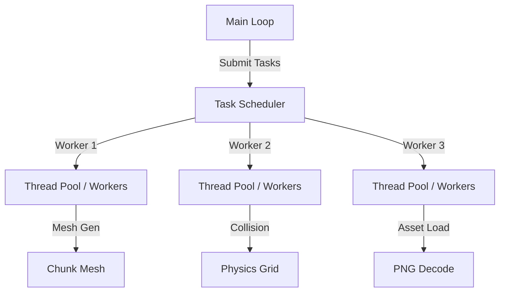

# Multithreading Analysis & Blueprint for Lili2D

This document outlines key areas in the **Lili2D** engine where multithreading can be introduced to prevent frame-rate drops, stuttering, and CPU bottlenecks.

Currently, Lili2D uses `std::async` for off-thread chunk mesh generation in `Chunk::rebuildBatches`. While this is a great start, there are several other critical bottlenecks that can be resolved.

---

## 1. Thread Pool & Task System (Core Infrastructure)
Before introducing concurrency to specific subsystems, you should implement a centralized **Task Scheduler** or **Thread Pool**. Spawning raw threads via `std::async` on-demand has high OS overhead.



> [!TIP]
> A simple queue of tasks (`std::function<void()>`) protected by a mutex and controlled by a condition variable with a pool of $N$ threads (where $N = \text{hardware\_concurrency} - 1$) is ideal.

---

## 2. ECS System & Component Processing
Lili2D uses a contiguous sparse-set `ComponentPool<T>` (defined in [component_pool.hpp](file:///home/lili/Documents/Lili2D/include/lili2d/ecs/component_pool.hpp)), which is extremely cache-friendly and well-suited for parallel processing.

### Opportunities:
1. **Component-level Parallelism (Data-Parallel):**
   For heavy systems operating on many entities (e.g., updating transforms, AI, particle simulations, or animation updates), you can divide the contiguous `dense_components` vector into slices and process them across threads.
   ```cpp
   // Example using C++17 parallel execution policy
   #include <execution>
   std::for_each(std::execution::par, pool.getComponents().begin(), pool.getComponents().end(), [](auto& component) {
       // CPU-heavy logic here (e.g. pathfinding, particle physics)
   });
   ```
2. **System-level Parallelism (Task-Parallel):**
   If you have multiple ECS systems that process disjoint component sets (e.g., a `MovementSystem` and an independent `AudioTriggerSystem`), you can run them concurrently on separate threads. You can construct a directed acyclic graph (DAG) of system dependencies to schedule them safely.

---

## 3. Collision Detection & Physics
Collision detection scales quadratically ($O(N^2)$) if not optimized. In [collision.cpp](file:///home/lili/Documents/Lili2D/src/physics/collision.cpp) and [tilemap.cpp](file:///home/lili/Documents/Lili2D/src/world/tilemap.cpp), there is no spatial partitioning, and checks are done linearly.

### Opportunities:
- **Broad-Phase Parallelization:** If you introduce spatial partitioning (e.g., a Quadtree or a Grid structure), you can update the tree structure or assign entities to grids in parallel.
- **Narrow-Phase Parallelization:** Once broad-phase identifies overlapping candidates (pairs of AABBs or Colliders), the list of collision pairs can be divided among worker threads to perform detailed intersection calculations and resolve forces.

---

## 4. Background Asset Loading
Currently, resource registration is synchronous. Loading large textures or fonts at runtime blocks the main thread, resulting in stuttering.

### Opportunities:
- **Offload Disk I/O & Decoding:** Load file bytes and perform CPU-intensive decoding (e.g., parsing PNG/JPG headers and raw pixel data) on a background thread.
- **Thread-safe GPU Upload:** Since GPU context operations (like creating `SDL_GPUTexture`) must generally occur on the main thread, the background thread can decode the image into a CPU buffer, wrap it in a task, and submit it back to the main thread's queue for final GPU upload.

```
[Main Thread] -------> Spawn Load Task -------> [Background Worker]
      |                                                |
      v (Continue game loop)                      Load & Decode PNG
      |                                                |
      v <--- Return CPU pixel buffer & Metadata <------v
GPU Upload (SDL_GPUTexture)
```

---

## 5. Tilemap & Chunk Rebuilding (Refining Existing Pattern)
Lili2D currently implements asynchronous mesh generation in `Chunk::rebuildBatches` ([chunk.cpp](file:///home/lili/Documents/Lili2D/src/world/chunk.cpp#L78-L98)):

```cpp
rebuild_future = std::async(
    std::launch::async,
    [this, chunk_pos, tile_size, tiles_copy = tiles]() {
        return generateMeshData(chunk_pos, tile_size, tiles_copy);
    }
);
```

### Improvements:
- **Avoid `std::async(std::launch::async)`:** This spawns an OS thread immediately, which is heavy. Replace it with your central **Thread Pool** or a task framework (like EnkiTS or taskflow).
- **Procedural World Generation:** Generate the tile data itself (using Perlin/Simplex noise) in background threads as players traverse the world, then instantiate chunks only when the data is ready.
- **Save/Load Serialization:** Serialize chunk files to disk on background threads.

---

## 6. Rendering Queue Sorting & Batching
In [renderer.cpp](file:///home/lili/Documents/Lili2D/src/render/renderer.cpp), draw commands are placed into queues like `world_2d_queue`, which are maps (`std::map<float, std::vector<DrawCommand>>`).

### Opportunities:
- **Parallel Sorting:** Sorting rendering queues by layer depth, shader, or texture handle is crucial to minimize GPU state changes. If there are thousands of draw commands, sorting them can be offloaded to worker threads during the update phase, preparing the sorted lists for the main thread to immediately feed to the GPU.
