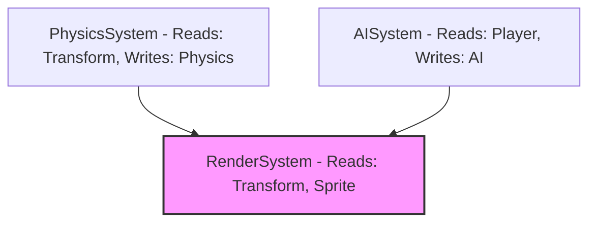

# Blueprint: Single-Threaded Fallbacks & Async Custom Systems

This document explains:
1. How to support both single-threaded (mono-threaded) and multi-threaded execution without code duplication (avoiding the `...Async` suffix pattern).
2. How to manage user-defined (custom) ECS systems asynchronously.

---

## 1. Single-Threaded Fallbacks: The "Caller Decides" Pattern

Duplicating functions into `foo()` and `fooAsync()` is generally an anti-pattern in C++ engine design. It duplicates tests and logic, and makes maintenance difficult.

### The Solution: Keep Functions Synchronous, Wrap at Caller Level
Keep functions strictly synchronous and "pure" (operating only on passed parameters). Let the caller decide whether to run it immediately on the main thread or defer it to the thread pool.

Here is how you can implement a toggle in your engine:

```cpp
class Chunk {
public:
    // This function does NOT care about threads. It just does the math.
    ChunkMeshData generateMeshData(Point3 chunk_pos, const Vec2& tile_size) const;

    void rebuild(ThreadPool* thread_pool, bool use_multithreading) {
        if (use_multithreading && thread_pool) {
            // Run asynchronously: offload to the thread pool
            rebuild_future = thread_pool->enqueue([this]() {
                return generateMeshData(pos, size);
            });
            is_async_running = true;
        } else {
            // Run synchronously: execute on the main thread immediately
            ChunkMeshData mesh = generateMeshData(pos, size);
            uploadMeshData(mesh); // Immediate upload
        }
    }
};
```

### Benefits of this Pattern:
* **Single source of truth:** The core computation (`generateMeshData`) is written and tested exactly once.
* **Easy debugging:** If you suspect a race condition or concurrency bug, you can set `use_multithreading = false` to run everything on a single thread instantly.

---

## 2. Managing Custom Systems Asynchronously

When users of your library write custom ECS systems (e.g., `CustomAISystem`, `WaterPhysicsSystem`), there are two primary ways to manage scheduling them.

### Approach A: The Explicit Model (User-Managed)
The engine exposes the `ThreadPool` to the systems. The systems run sequentially on the main thread, but internally parallelize their work.

```mermaid
gantt
    title Approach A: Sequential Systems, Parallel Internal Work
    dateFormat  S
    axisFormat %S
    section Main Thread
    System A (Physics)      :a1, 0, 5s
    System B (Custom AI)    :a2, after a1, 4s
    section Thread Pool
    System A Workers        :w1, 0, 5s
    System B Workers        :w2, 5s, 9s
```

#### Example implementation:
The user overrides the `update` method and enqueues worker tasks inside it:

```cpp
class CustomAISystem : public lili::System {
public:
    void update(lili::ECSRegistry& registry, float dt, lili::ThreadPool& pool) override {
        auto& agents = registry.getPool<AIComponent>().getComponents();
        
        std::vector<std::future<void>> results;
        size_t batch_size = 250;
        
        // Chunk AI entities into packages and process in parallel
        for (size_t i = 0; i < agents.size(); i += batch_size) {
            size_t end = std::min(i + batch_size, agents.size());
            results.push_back(pool.enqueue([&agents, i, end, dt]() {
                for (size_t idx = i; idx < end; ++idx) {
                    agents[idx].think(dt); // CPU heavy AI behavior
                }
            }));
        }
        
        // Block the main thread until AI calculations finish
        for (auto& f : results) {
            f.wait();
        }
    }
};
```
* **Pros:** Simple to design; users have complete control over what is parallelized.
* **Cons:** The main thread still waits sequentially for each system to finish before starting the next.

---

### Approach B: The Implicit Model (Engine-Managed DAG)
The engine schedules entire systems in parallel. The user registers custom systems and defines their read/write dependencies (which components they write to or read from). The engine then builds a **Directed Acyclic Graph (DAG)** and executes independent systems concurrently.



In the diagram above, `PhysicsSystem` and `AISystem` can run concurrently because they do not have overlapping write dependencies. `RenderSystem` must wait for both to complete.

#### Example Implementation of a DAG Runner:
You can provide a registry where systems declare their dependencies:

```cpp
struct SystemDependency {
    std::vector<uint32_t> read_components;
    std::vector<uint32_t> write_components;
};

class SystemRunner {
public:
    void addSystem(std::unique_ptr<System> system, SystemDependency deps) {
        systems.push_back(std::move(system));
        dependencies.push_back(deps);
    }

    void update(ECSRegistry& registry, float dt, ThreadPool& pool) {
        // 1. Analyze read/write components to find independent groups.
        // 2. Enqueue independent systems to run in parallel.
        // 3. Coordinate completion using std::shared_future or atomic counters.
    }
    
private:
    std::vector<std::unique_ptr<System>> systems;
    std::vector<SystemDependency> dependencies;
};
```

> [!CAUTION]
> If multiple systems write to the same component type concurrently, it will cause **undefined behavior** and data races. If using the DAG runner model, the engine *must* enforce that no two parallel systems write to the same component pool simultaneously.
